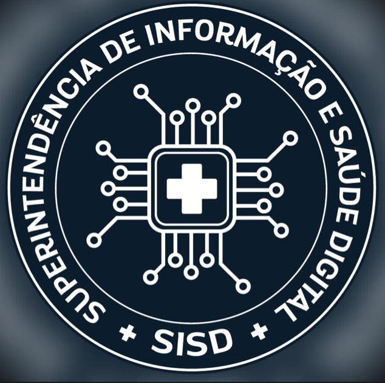

# Agenda Diego Daltro — Arquitetura e Código-Fonte Completo

> Documento gerado para consolidar a arquitetura do sistema e uma cópia integral do código-fonte, conforme solicitado. Repositório: [rafaelfildis/diegodaltrodaily](https://github.com/rafaelfildis/diegodaltrodaily).

## 1. Visão geral

Aplicação web de agenda institucional (SISD/SESAB) que sincroniza automaticamente com um calendário Outlook/Microsoft 365 publicado em formato **ICS**. Não há framework/bundler no frontend — é HTML/CSS/JS puro. O backend é uma camada fina cujo único papel é contornar CORS ao buscar o ICS do Outlook.

```
Navegador (index.html + script.js + styles.css)
        │
        │ 1. fetch(CALENDAR_ICS_URL) direto ao Outlook
        │    (normalmente bloqueado por CORS)
        ▼
        │ 2. fallback: fetch(/api/calendar)
        ▼
┌───────────────────────────────┐
│  server.js (Express, local)   │   OU   ┌────────────────────────────┐
│  ou api/calendar.js (Vercel)  │───────▶│ outlook.office365.com (ICS)│
│  proxy + cache em memória     │        └────────────────────────────┘
└───────────────────────────────┘
        │
        ▼
  ical.js interpreta o ICS inteiramente no cliente
  (RRULE, EXDATE, RECURRENCE-ID, VTIMEZONE → America/Bahia)
        │
        ▼
  localStorage guarda o último resultado processado
  (fallback quando a rede/Outlook falha)
```

## 2. Stack

- **Frontend**: HTML5 + CSS3 + JavaScript puro (ES module), sem bundler.
  - [ical.js](https://github.com/kewisch/ical.js) — parsing do ICS (VEVENT, RRULE, EXDATE, RECURRENCE-ID, VTIMEZONE), via CDN.
  - [html2canvas](https://html2canvas.hertzen.com/) + [jsPDF](https://github.com/parallax/jsPDF) — exportação em JPEG/PDF, via CDN.
- **Backend**: Node.js + Express (`server.js`) para rodar localmente/qualquer host Node; `api/calendar.js` é a mesma lógica reescrita como função serverless para deploy na Vercel (que não executa Express diretamente).
- **Persistência**: nenhum banco de dados. Cache em memória (servidor, TTL configurável) + `localStorage` (cliente, fallback offline).

## 3. Estrutura de arquivos

```
agenda/
├── index.html          Estrutura da página (topbar, sidebar, dashboard, timeline, tabela, painéis/modais)
├── styles.css           Todo o CSS (design system em custom properties, responsivo, print)
├── script.js            Toda a lógica: fetch/parse ICS, filtros, render, exportação PDF/JPEG/texto
├── server.js             Servidor Express (uso local) — proxy /api/calendar
├── api/calendar.js       Função serverless equivalente (deploy Vercel)
├── package.json          Dependência única: express
├── .env.example          Variáveis opcionais (CALENDAR_ICS_URL, ALLOWED_ORIGIN, CACHE_TTL_MS)
└── README.md             Documentação original do projeto (reproduzida na seção 8)
```

## 4. Modelo de dados do evento

Cada compromisso, depois de parseado do ICS, vira este objeto (usado em todo o `script.js`):

```js
{
  id: "identificador-unico",
  titulo: "Título do compromisso",
  descricao: "Descrição do compromisso",
  inicio: "2026-07-20T09:00:00-03:00",
  fim: "2026-07-20T10:00:00-03:00",
  diaInteiro: false,
  local: "Local do compromisso",
  link: "Link da reunião",
  categoria: "pauta-online",       // viagem | mestrado | pauta-online | pauta-presencial
  categoriasIcs: ["..."],
  status: "confirmado",
  recorrente: false,
  conflito: false                   // calculado em runtime por marcarConflitos()
}
```

## 5. Fluxo de renderização (script.js)

`renderizarConteudo()` é o disparador central, chamado sempre que um filtro muda:

1. `obterEventosFiltrados()` — aplica período, categorias, busca, intervalo de datas e o toggle "mostrar concluídos".
2. `preencherTimeline(filtrados)` — agrupa por dia e monta os cards (`criarCardElemento`).
3. `preencherTabela(filtrados)` — visão alternativa em tabela ordenável/paginada.
4. `renderizarDashboard(filtrados)` — atualiza os indicadores (Em andamento / Próximos / Concluídos), o título da página conforme o período, e o banner de conflito.
5. `renderizarFiltrosAtivos()` — chips removíveis dos filtros ativos.

Conflitos de horário são calculados por `marcarConflitos(eventos)` (varredura por dia, O(n²) mas n é pequeno por dia) e o status temporal (`andamento` / `futuro` / `concluido`) por `situacaoTemporal(evento)`, comparando `Date.now()` com início/fim.

## 6. Decisões de implementação (do README original)

- Recorrência (RRULE/EXDATE/RECURRENCE-ID) é resolvida inteiramente por `ical.js` — não há um segundo motor de recorrência.
- Horários sempre exibidos em `America/Bahia`, independente do fuso do navegador, usando os `VTIMEZONE` registrados via `ICAL.TimezoneService`.
- Recorrência expandida de 1 mês no passado a 6 meses no futuro (`JANELA_MESES_PASSADO` / `JANELA_MESES_FUTURO`).
- Classificação automática de categoria por palavras-chave (`classificarEvento`), prioridade: viagem → mestrado → pauta online → pauta presencial.
- `server.js` e `api/calendar.js` duplicam a mesma lógica de proxy porque a Vercel não executa Express diretamente — são dois deploys-alvo para o mesmo propósito.

## 7. Histórico de mudanças de UI

**Sessão anterior**

- Corrigido bug em que o botão de recolher a sidebar ficava inacessível após recolhida (`width:0` escondia o próprio botão de reabrir) — agora encolhe para uma faixa de 48px.
- Adicionado título dinâmico "Agenda de Hoje" / "Agenda da Semana" / etc., banner de conflito de horário, e os 3 cartões de status (Em andamento / Próximos / Concluídos).
- Cards da timeline redesenhados em layout horizontal (horário à esquerda, conteúdo à direita), com borda colorida à esquerda para o compromisso atual (verde, tag "● Agora") e para conflitos (vermelho, ícone de alerta).

**Sessão atual**

- **Modo escuro**: alternância claro/escuro na topbar (botão sol/lua), respeitando `prefers-color-scheme` por padrão, com a escolha persistida em `localStorage` e aplicada antes da primeira pintura (sem "flash"). Paleta escura definida por overrides das custom properties em `@media (prefers-color-scheme: dark)` e `:root[data-theme="dark"]`.
- **Polimento visual**: ícones nos 3 cartões de indicadores, skeleton loading na primeira carga, estado vazio ilustrado, animação de entrada dos cards, scrollbar personalizada e gradiente na topbar — tudo respeitando `prefers-reduced-motion`.
- **Compromissos de vários dias**: eventos que atravessam mais de um dia (viagens, módulos de mestrado etc.) passam a aparecer na agenda de **cada dia** que ocupam (`diasQueEventoAbrange`), com horário contextual por dia e badge de intervalo. Refletido também nas exportações (PDF/JPEG/texto). O recorte respeita a janela de filtro (período e datas De/Até) via `janelaDeExibicaoAtual`, sem vazar para dias fora do filtro.
- **DTEND exclusivo em eventos de dia inteiro**: o `DTEND` de eventos de dia inteiro é exclusivo no iCalendar (RFC 5545) — um evento que ocupa 22 a 25 traz `DTEND` = dia 26. `dataFimInclusivo` recua para o último dia realmente ocupado, corrigindo a exibição (deixava aparecer um dia a mais), a contagem de dias abrangidos, os filtros e as exportações.
- **Exportação JPEG mobile completa**: no formato mobile vertical, o cartão de exportação (`construirCardExportacaoDetalhado`) passa a exibir todos os dados do compromisso — título, horário, duração, local, descrição e link — em layout empilhado. Os formatos A4 (JPEG/PDF) seguem com o cartão minimalista.

---

## 8. Código-fonte completo

### `package.json`

```json
{
  "name": "agenda-sisd",
  "version": "1.0.0",
  "private": true,
  "description": "Agenda web responsiva com sincronização automática de calendário Outlook/Microsoft 365 (ICS).",
  "main": "server.js",
  "scripts": {
    "start": "node server.js",
    "dev": "node server.js"
  },
  "engines": {
    "node": ">=18"
  },
  "dependencies": {
    "express": "^4.19.2"
  }
}
```

### `index.html`

```html
<!DOCTYPE html>
<html lang="pt-BR">
<head>
<meta charset="UTF-8" />
<meta name="viewport" content="width=device-width, initial-scale=1, viewport-fit=cover" />
<title>Agenda Diego Daltro - SISD/SESAB</title>
<meta name="description" content="Agenda institucional com sincronização automática do calendário Outlook/Microsoft 365." />
<meta name="theme-color" content="#061A35" id="meta-theme-color" />
<script>
  // Aplica o tema salvo antes da primeira pintura, evitando o "flash" de
  // tela clara ao carregar com o modo escuro já escolhido anteriormente.
  (function () {
    try {
      var tema = localStorage.getItem("agendaSisd.tema");
      if (tema === "dark" || tema === "light") {
        document.documentElement.setAttribute("data-theme", tema);
      }
    } catch (e) {
      /* ignora */
    }
  })();
</script>
<link rel="stylesheet" href="styles.css" />
</head>
<body>

  <a class="skip-link" href="#conteudo-principal">Pular para o conteúdo principal</a>

  <header class="topbar">
    <div class="topbar__left">
      <button id="btn-menu" class="icon-btn topbar__menu-btn" type="button" aria-label="Abrir menu de navegação" aria-controls="sidebar" aria-expanded="false">
        <svg viewBox="0 0 24 24" width="22" height="22" fill="none" stroke="currentColor" stroke-width="2" stroke-linecap="round"><line x1="3" y1="6" x2="21" y2="6"></line><line x1="3" y1="12" x2="21" y2="12"></line><line x1="3" y1="18" x2="21" y2="18"></line></svg>
      </button>

      <div class="topbar__brand">
        
        <span class="topbar__logo" aria-hidden="true">
          <svg viewBox="0 0 24 24" width="26" height="26" fill="none" stroke="currentColor" stroke-width="1.8" stroke-linecap="round" stroke-linejoin="round">
            <rect x="3" y="4" width="18" height="17" rx="2"></rect>
            <line x1="16" y1="2" x2="16" y2="6"></line>
            <line x1="8" y1="2" x2="8" y2="6"></line>
            <line x1="3" y1="10" x2="21" y2="10"></line>
            <path d="M8 14h2M8 17h5"></path>
          </svg>
        </span>
        <div class="topbar__titles">
          <h1>Agenda Diego Daltro</h1>
          <p>SISD/SESAB — Compromissos sincronizados do Outlook / Microsoft 365</p>
        </div>
      </div>
    </div>

    <div class="topbar__search">
      <svg class="topbar__search-icon" viewBox="0 0 24 24" width="16" height="16" fill="none" stroke="currentColor" stroke-width="2" stroke-linecap="round" stroke-linejoin="round" aria-hidden="true"><circle cx="11" cy="11" r="8"></circle><line x1="21" y1="21" x2="16.65" y2="16.65"></line></svg>
      <input id="busca" type="search" placeholder="Buscar por título, descrição ou local…" aria-label="Busca global de compromissos" />
    </div>

    <div class="topbar__actions">
      <button id="btn-tema" class="icon-btn topbar__theme-btn" type="button" aria-label="Alternar entre tema claro e escuro" aria-pressed="false">
        <svg class="icone-tema icone-tema--lua" viewBox="0 0 24 24" width="18" height="18" fill="none" stroke="currentColor" stroke-width="2" stroke-linecap="round" stroke-linejoin="round" aria-hidden="true"><path d="M21 12.79A9 9 0 1 1 11.21 3 7 7 0 0 0 21 12.79z"></path></svg>
        <svg class="icone-tema icone-tema--sol" viewBox="0 0 24 24" width="18" height="18" fill="none" stroke="currentColor" stroke-width="2" stroke-linecap="round" stroke-linejoin="round" aria-hidden="true"><circle cx="12" cy="12" r="5"></circle><line x1="12" y1="1" x2="12" y2="3"></line><line x1="12" y1="21" x2="12" y2="23"></line><line x1="4.22" y1="4.22" x2="5.64" y2="5.64"></line><line x1="18.36" y1="18.36" x2="19.78" y2="19.78"></line><line x1="1" y1="12" x2="3" y2="12"></line><line x1="21" y1="12" x2="23" y2="12"></line><line x1="4.22" y1="19.78" x2="5.64" y2="18.36"></line><line x1="18.36" y1="5.64" x2="19.78" y2="4.22"></line></svg>
      </button>
      <button id="btn-atualizar" class="btn btn--primary" type="button">
        <svg viewBox="0 0 24 24" width="16" height="16" fill="none" stroke="currentColor" stroke-width="2" stroke-linecap="round" stroke-linejoin="round"><polyline points="23 4 23 10 17 10"></polyline><polyline points="1 20 1 14 7 14"></polyline><path d="M3.51 9a9 9 0 0 1 14.85-3.36L23 10M1 14l4.64 4.36A9 9 0 0 0 20.49 15"></path></svg>
        <span class="btn__label">Atualizar</span>
      </button>
      <a id="btn-abrir-outlook" class="btn btn--ghost-dark" href="#" target="_blank" rel="noopener">
        <svg viewBox="0 0 24 24" width="16" height="16" fill="none" stroke="currentColor" stroke-width="2" stroke-linecap="round" stroke-linejoin="round"><path d="M18 13v6a2 2 0 0 1-2 2H5a2 2 0 0 1-2-2V8a2 2 0 0 1 2-2h6"></path><polyline points="15 3 21 3 21 9"></polyline><line x1="10" y1="14" x2="21" y2="3"></line></svg>
        <span class="btn__label">Abrir no Outlook</span>
      </a>
    </div>
  </header>

  <div class="app-shell" id="app-shell">
    <div id="sidebar-backdrop" class="sidebar-backdrop" hidden></div>

    <aside id="sidebar" class="sidebar" aria-label="Navegação e filtros">
      <nav class="sidebar__nav" aria-label="Navegação principal">
        <a class="sidebar__nav-item is-active" href="#conteudo-principal">
          <svg viewBox="0 0 24 24" width="18" height="18" fill="none" stroke="currentColor" stroke-width="1.8" stroke-linecap="round" stroke-linejoin="round" aria-hidden="true"><rect x="3" y="4" width="18" height="17" rx="2"></rect><line x1="16" y1="2" x2="16" y2="6"></line><line x1="8" y1="2" x2="8" y2="6"></line><line x1="3" y1="10" x2="21" y2="10"></line></svg>
          <span class="sidebar__nav-label">Agenda</span>
        </a>
      </nav>

      <div class="sidebar__filters">
        <div class="filters__group">
          <span class="filters__label" id="label-filtrar-data">Filtrar por data</span>
          <div class="date-range" role="group" aria-labelledby="label-filtrar-data">
            <label class="date-range__field">
              <span>De</span>
              <input id="filtro-data-inicio" class="input" type="date" />
            </label>
            <label class="date-range__field">
              <span>Até</span>
              <input id="filtro-data-fim" class="input" type="date" />
            </label>
          </div>
          <p id="erro-data" class="form-error" role="alert" hidden></p>
          <button id="btn-limpar-datas" class="link-button" type="button" hidden>Limpar datas</button>
        </div>

        <div class="filters__group">
          <span class="filters__label" id="label-periodo">Período</span>
          <div class="chip-group" id="periodo-group" role="group" aria-labelledby="label-periodo">
            <button class="chip" data-periodo="todos" type="button">Todos</button>
            <button class="chip is-active" data-periodo="dia" type="button">Hoje</button>
            <button class="chip" data-periodo="semana" type="button">Semana</button>
            <button class="chip" data-periodo="mes" type="button">Mês</button>
          </div>
        </div>

        <div class="filters__group">
          <span class="filters__label" id="label-categorias">Categorias</span>
          <div class="chip-group" id="categoria-group" role="group" aria-labelledby="label-categorias">
            <button class="chip chip--categoria" data-categoria="viagem" type="button">✈ Viagens</button>
            <button class="chip chip--categoria" data-categoria="mestrado" type="button">🎓 Mestrado</button>
            <button class="chip chip--categoria" data-categoria="pauta-online" type="button">💻 Pauta online</button>
            <button class="chip chip--categoria" data-categoria="pauta-presencial" type="button">🏛 Pauta presencial</button>
          </div>
        </div>

        <div class="filters__group filters__group--inline">
          <label class="switch">
            <input type="checkbox" id="mostrar-concluidos" checked />
            <span class="switch__track"><span class="switch__thumb"></span></span>
            <span>Mostrar concluídos</span>
          </label>
        </div>
      </div>

      <button id="btn-recolher-sidebar" class="sidebar__collapse-btn" type="button" aria-expanded="true">
        <svg viewBox="0 0 24 24" width="16" height="16" fill="none" stroke="currentColor" stroke-width="2" stroke-linecap="round" stroke-linejoin="round" aria-hidden="true"><polyline points="15 18 9 12 15 6"></polyline></svg>
        <span>Recolher menu</span>
      </button>
    </aside>

    <main id="conteudo-principal" class="main" tabindex="-1">
      <nav class="breadcrumbs" aria-label="Trilha de navegação">
        <ol>
          <li><a href="#conteudo-principal">Início</a></li>
          <li aria-current="page">Agenda</li>
        </ol>
      </nav>

      <h2 class="page-title" id="page-title">Agenda de Hoje</h2>

      <div id="conflict-alert" class="conflict-alert" role="alert" hidden>
        <span class="conflict-alert__icon" aria-hidden="true">
          <svg viewBox="0 0 24 24" width="22" height="22" fill="none" stroke="currentColor" stroke-width="2.5" stroke-linecap="round" stroke-linejoin="round"><path d="M10.29 3.86 1.82 18a2 2 0 0 0 1.71 3h16.94a2 2 0 0 0 1.71-3L13.71 3.86a2 2 0 0 0-3.42 0z"></path><path d="M12 9v4"></path><path d="M12 17h.01"></path></svg>
        </span>
        <div class="conflict-alert__texto">
          <strong>Conflito de horário detectado</strong>
          <span id="conflict-alert-detalhe"></span>
        </div>
      </div>

      <section class="dashboard" aria-label="Indicadores da agenda">
        <div class="stat-card stat-card--andamento">
          <span class="stat-card__icone" aria-hidden="true">
            <svg viewBox="0 0 24 24" width="17" height="17" fill="none" stroke="currentColor" stroke-width="2" stroke-linecap="round" stroke-linejoin="round"><circle cx="12" cy="12" r="10"></circle><polyline points="12 6 12 12 16 14"></polyline></svg>
          </span>
          <span class="stat-card__valor" id="stat-andamento">0</span>
          <span class="stat-card__rotulo">Em andamento</span>
        </div>
        <div class="stat-card stat-card--proximos">
          <span class="stat-card__icone" aria-hidden="true">
            <svg viewBox="0 0 24 24" width="17" height="17" fill="none" stroke="currentColor" stroke-width="2" stroke-linecap="round" stroke-linejoin="round"><rect x="3" y="4" width="18" height="17" rx="2"></rect><line x1="16" y1="2" x2="16" y2="6"></line><line x1="8" y1="2" x2="8" y2="6"></line><line x1="3" y1="10" x2="21" y2="10"></line></svg>
          </span>
          <span class="stat-card__valor" id="stat-proximos">0</span>
          <span class="stat-card__rotulo">Próximos</span>
        </div>
        <div class="stat-card stat-card--concluidos">
          <span class="stat-card__icone" aria-hidden="true">
            <svg viewBox="0 0 24 24" width="17" height="17" fill="none" stroke="currentColor" stroke-width="2" stroke-linecap="round" stroke-linejoin="round"><path d="M22 11.08V12a10 10 0 1 1-5.93-9.14"></path><polyline points="22 4 12 14.01 9 11.01"></polyline></svg>
          </span>
          <span class="stat-card__valor" id="stat-concluidos">0</span>
          <span class="stat-card__rotulo">Concluídos</span>
        </div>
      </section>

      <div class="status-bar" id="status-bar">
        <div class="status-bar__info">
          <span id="status-loading" class="status-pill status-pill--loading" hidden>
            <span class="spinner" aria-hidden="true"></span> Atualizando agenda…
          </span>
          <span id="status-success" class="status-pill status-pill--success" hidden>
            <svg viewBox="0 0 24 24" width="14" height="14" fill="none" stroke="currentColor" stroke-width="2.5" stroke-linecap="round" stroke-linejoin="round"><polyline points="20 6 9 17 4 12"></polyline></svg>
            Agenda atualizada
          </span>
          <span id="status-error" class="status-pill status-pill--error" hidden>
            <svg viewBox="0 0 24 24" width="14" height="14" fill="none" stroke="currentColor" stroke-width="2.5" stroke-linecap="round" stroke-linejoin="round"><circle cx="12" cy="12" r="10"></circle><line x1="12" y1="8" x2="12" y2="12"></line><line x1="12" y1="16" x2="12.01" y2="16"></line></svg>
            <span id="status-error-msg">Não foi possível atualizar a agenda.</span>
            <button id="btn-tentar-novamente" class="btn btn--tiny" type="button">Tentar novamente</button>
          </span>
          <span id="status-cache" class="status-pill status-pill--warning" hidden>
            <svg viewBox="0 0 24 24" width="14" height="14" fill="none" stroke="currentColor" stroke-width="2.5" stroke-linecap="round" stroke-linejoin="round"><path d="M12 9v4"></path><path d="M12 17h.01"></path><path d="M10.29 3.86 1.82 18a2 2 0 0 0 1.71 3h16.94a2 2 0 0 0 1.71-3L13.71 3.86a2 2 0 0 0-3.42 0z"></path></svg>
            Exibindo dados salvos localmente — podem estar desatualizados.
          </span>
        </div>
        <div class="status-bar__updated">
          Última atualização: <strong id="ultima-atualizacao">—</strong>
        </div>
      </div>

      <section class="active-filters" id="active-filters" aria-live="polite" hidden>
        <div class="active-filters__lista" id="active-filters-lista"></div>
        <button id="btn-limpar-filtros" class="link-button" type="button">Limpar todos os filtros</button>
      </section>

      <section class="content-toolbar">
        <div class="filters__summary" id="filtros-resumo">0 compromissos</div>
        <div class="view-toggle" role="group" aria-label="Modo de visualização">
          <button class="view-toggle__btn is-active" id="btn-vista-timeline" data-vista="timeline" type="button">
            <svg viewBox="0 0 24 24" width="15" height="15" fill="none" stroke="currentColor" stroke-width="2" stroke-linecap="round" stroke-linejoin="round" aria-hidden="true"><line x1="8" y1="6" x2="21" y2="6"></line><line x1="8" y1="12" x2="21" y2="12"></line><line x1="8" y1="18" x2="21" y2="18"></line><line x1="3" y1="6" x2="3.01" y2="6"></line><line x1="3" y1="12" x2="3.01" y2="12"></line><line x1="3" y1="18" x2="3.01" y2="18"></line></svg>
            Linha do tempo
          </button>
          <button class="view-toggle__btn" id="btn-vista-tabela" data-vista="tabela" type="button">
            <svg viewBox="0 0 24 24" width="15" height="15" fill="none" stroke="currentColor" stroke-width="2" stroke-linecap="round" stroke-linejoin="round" aria-hidden="true"><rect x="3" y="3" width="18" height="18" rx="2"></rect><line x1="3" y1="9" x2="21" y2="9"></line><line x1="3" y1="15" x2="21" y2="15"></line><line x1="9" y1="9" x2="9" y2="21"></line></svg>
            Tabela
          </button>
        </div>
      </section>

      <section class="timeline-wrap" id="vista-timeline">
        <div id="timeline" class="timeline" aria-live="polite"></div>
        <div id="timeline-vazio" class="timeline-vazio" hidden>
          <svg class="timeline-vazio__icone" viewBox="0 0 24 24" width="40" height="40" fill="none" stroke="currentColor" stroke-width="1.5" stroke-linecap="round" stroke-linejoin="round" aria-hidden="true"><rect x="3" y="4" width="18" height="17" rx="2"></rect><line x1="16" y1="2" x2="16" y2="6"></line><line x1="8" y1="2" x2="8" y2="6"></line><line x1="3" y1="10" x2="21" y2="10"></line><path d="m9.5 15.5 2-2 2 2 2-2"></path></svg>
          <p>Nenhum compromisso encontrado para os filtros selecionados.</p>
        </div>
      </section>

      <section class="table-wrap" id="vista-tabela" hidden>
        <div class="table-scroll">
          <table class="data-table" id="tabela-eventos">
            <thead>
              <tr>
                <th scope="col"><button class="th-sort" data-sort="data" type="button">Data <span class="th-sort__icon" aria-hidden="true">↕</span></button></th>
                <th scope="col"><button class="th-sort" data-sort="horario" type="button">Horário <span class="th-sort__icon" aria-hidden="true">↕</span></button></th>
                <th scope="col"><button class="th-sort" data-sort="titulo" type="button">Título <span class="th-sort__icon" aria-hidden="true">↕</span></button></th>
                <th scope="col"><button class="th-sort" data-sort="categoria" type="button">Categoria <span class="th-sort__icon" aria-hidden="true">↕</span></button></th>
                <th scope="col"><button class="th-sort" data-sort="local" type="button">Local <span class="th-sort__icon" aria-hidden="true">↕</span></button></th>
                <th scope="col"><button class="th-sort" data-sort="status" type="button">Status <span class="th-sort__icon" aria-hidden="true">↕</span></button></th>
                <th scope="col"><span class="sr-only">Detalhes</span></th>
              </tr>
            </thead>
            <tbody id="tabela-corpo"></tbody>
          </table>
        </div>
        <div class="table-pagination" id="table-pagination">
          <button id="btn-pagina-anterior" class="btn btn--tiny-outline" type="button">‹ Anterior</button>
          <span id="pagina-info" aria-live="polite">Página 1 de 1</span>
          <button id="btn-pagina-proxima" class="btn btn--tiny-outline" type="button">Próxima ›</button>
        </div>
      </section>

    </main>
  </div>

  <section class="export-bar" aria-label="Exportação">
    <div class="export-bar__group">
      <span class="filters__label" id="label-export-formato">Formato</span>
      <div class="chip-group" id="export-formato-group" role="group" aria-labelledby="label-export-formato">
        <button class="chip is-active" data-formato="a4" type="button">A4</button>
        <button class="chip" data-formato="mobile" type="button">Mobile vertical</button>
      </div>
    </div>
    <div class="export-bar__actions">
      <button id="btn-exportar-pdf" class="btn btn--secondary" type="button">Exportar PDF</button>
      <button id="btn-exportar-jpeg" class="btn btn--secondary" type="button">Exportar JPEG</button>
      <button id="btn-exportar-texto" class="btn btn--secondary" type="button">Exportar Texto</button>
    </div>
  </section>

  <footer class="app-footer">
    <p>Agenda Diego Daltro — SISD/SESAB — dados sincronizados automaticamente a cada 15 minutos. Fuso horário: America/Bahia.</p>
  </footer>

  <div id="export-sandbox" class="export-sandbox" aria-hidden="true"></div>

  <div id="panel-backdrop" class="panel-backdrop" hidden></div>
  <aside id="detail-panel" class="detail-panel" aria-hidden="true" aria-label="Detalhes do compromisso">
    <div class="detail-panel__header">
      <h2 id="detail-panel-titulo">Detalhes do compromisso</h2>
      <button id="btn-fechar-painel" class="icon-btn" type="button" aria-label="Fechar painel de detalhes">
        <svg viewBox="0 0 24 24" width="18" height="18" fill="none" stroke="currentColor" stroke-width="2" stroke-linecap="round" stroke-linejoin="round"><line x1="18" y1="6" x2="6" y2="18"></line><line x1="6" y1="6" x2="18" y2="18"></line></svg>
      </button>
    </div>
    <div class="detail-panel__body" id="detail-panel-corpo"></div>
  </aside>

  <div id="confirm-backdrop" class="panel-backdrop" hidden></div>
  <div id="confirm-modal" class="confirm-modal" role="alertdialog" aria-modal="true" aria-labelledby="confirm-titulo" aria-describedby="confirm-mensagem" hidden>
    <h2 id="confirm-titulo">Confirmar exportação</h2>
    <p id="confirm-mensagem"></p>
    <div class="confirm-modal__acoes">
      <button id="confirm-cancelar" class="btn btn--ghost" type="button">Cancelar</button>
      <button id="confirm-continuar" class="btn btn--primary" type="button">Continuar</button>
    </div>
  </div>

  <div id="text-export-backdrop" class="panel-backdrop" hidden></div>
  <div id="text-export-modal" class="text-export-modal" role="dialog" aria-modal="true" aria-labelledby="text-export-titulo" hidden>
    <div class="text-export-modal__header">
      <h2 id="text-export-titulo">Exportar em texto</h2>
      <button id="btn-fechar-texto" class="icon-btn" type="button" aria-label="Fechar">
        <svg viewBox="0 0 24 24" width="18" height="18" fill="none" stroke="currentColor" stroke-width="2" stroke-linecap="round" stroke-linejoin="round"><line x1="18" y1="6" x2="6" y2="18"></line><line x1="6" y1="6" x2="18" y2="18"></line></svg>
      </button>
    </div>
    <textarea id="text-export-conteudo" class="text-export-modal__area" readonly></textarea>
    <div class="text-export-modal__acoes">
      <span id="text-export-copiado" class="text-export-modal__aviso" hidden>Copiado!</span>
      <button id="btn-fechar-texto-2" class="btn btn--ghost" type="button">Fechar</button>
      <button id="btn-copiar-texto" class="btn btn--primary" type="button">Copiar texto</button>
    </div>
  </div>

  <script src="https://cdnjs.cloudflare.com/ajax/libs/html2canvas/1.4.1/html2canvas.min.js"></script>
  <script src="https://cdnjs.cloudflare.com/ajax/libs/jspdf/2.5.1/jspdf.umd.min.js"></script>
  <script type="module" src="script.js"></script>
</body>
</html>
```

### `styles.css`

```css
/* ==========================================================================
   Agenda Diego Daltro — SISD/SESAB
   Identidade visual "Saúde Digital": institucional, tecnológica, acessível.
   ========================================================================== */

:root {
  --color-primary: #061A35;
  --color-primary-dark: #031124;
  --color-secondary: #174D83;
  --color-accent: #55A9E8;
  --color-background: #F5F8FC;
  --color-surface: #FFFFFF;
  --color-text-primary: #10233C;
  --color-text-secondary: #607086;
  --color-border: #DCE5EF;
  --color-success: #2E8B68;
  --color-warning: #D99A2B;
  --color-error: #C94B4B;

  --color-secondary-tint: #E9F1FA;
  --color-accent-tint: #E7F3FD;
  --color-success-tint: #E6F4EE;
  --color-warning-tint: #FBF1DF;
  --color-error-tint: #FBEAEA;
  --color-pautaonline-texto: #1F6FB0;
  --color-continuo-tint: #E1F5F7;
  --color-continuo-texto: #0E7C86;

  --sombra-leve: 0 1px 3px rgba(6, 26, 53, 0.08), 0 1px 2px rgba(6, 26, 53, 0.06);
  --sombra-media: 0 8px 24px rgba(6, 26, 53, 0.16);
  --raio: 12px;
  --raio-pequeno: 8px;
  --topbar-altura: 64px;

  --color-recorrente-tint: #EFEAFB;
  --color-recorrente-texto: #6B4FBF;

  --fonte: "Segoe UI", -apple-system, BlinkMacSystemFont, "Helvetica Neue", Arial, sans-serif;

  color-scheme: light;
}

/* Tema escuro: segue a preferência do sistema por padrão, e pode ser
   fixado manualmente (data-theme) via o botão na topbar, sobrepondo-se
   à preferência do sistema em qualquer direção. */
@media (prefers-color-scheme: dark) {
  :root:not([data-theme="light"]) {
    --color-primary: #0B2545;
    --color-primary-dark: #071A33;
    --color-secondary: #4A9FE0;
    --color-accent: #6FC1FF;
    --color-background: #0F1720;
    --color-surface: #17222E;
    --color-text-primary: #E8EEF5;
    --color-text-secondary: #94A6BA;
    --color-border: #2B3948;
    --color-success: #4FB784;
    --color-warning: #E3B25B;
    --color-error: #E27272;

    --color-secondary-tint: rgba(74, 159, 224, 0.16);
    --color-accent-tint: rgba(111, 193, 255, 0.16);
    --color-success-tint: rgba(79, 183, 132, 0.16);
    --color-warning-tint: rgba(227, 178, 91, 0.16);
    --color-error-tint: rgba(226, 114, 114, 0.16);
    --color-recorrente-tint: rgba(151, 122, 224, 0.18);
    --color-recorrente-texto: #B7A6F2;
    --color-pautaonline-texto: #8FD1FF;
    --color-continuo-tint: rgba(45, 197, 208, 0.18);
    --color-continuo-texto: #6FE0E8;

    --sombra-leve: 0 1px 3px rgba(0, 0, 0, 0.35), 0 1px 2px rgba(0, 0, 0, 0.3);
    --sombra-media: 0 8px 24px rgba(0, 0, 0, 0.5);

    color-scheme: dark;
  }
}

:root[data-theme="dark"] {
  --color-primary: #0B2545;
  --color-primary-dark: #071A33;
  --color-secondary: #4A9FE0;
  --color-accent: #6FC1FF;
  --color-background: #0F1720;
  --color-surface: #17222E;
  --color-text-primary: #E8EEF5;
  --color-text-secondary: #94A6BA;
  --color-border: #2B3948;
  --color-success: #4FB784;
  --color-warning: #E3B25B;
  --color-error: #E27272;

  --color-secondary-tint: rgba(74, 159, 224, 0.16);
  --color-accent-tint: rgba(111, 193, 255, 0.16);
  --color-success-tint: rgba(79, 183, 132, 0.16);
  --color-warning-tint: rgba(227, 178, 91, 0.16);
  --color-error-tint: rgba(226, 114, 114, 0.16);
  --color-recorrente-tint: rgba(151, 122, 224, 0.18);
  --color-recorrente-texto: #B7A6F2;
  --color-pautaonline-texto: #8FD1FF;
  --color-continuo-tint: rgba(45, 197, 208, 0.18);
  --color-continuo-texto: #6FE0E8;

  --sombra-leve: 0 1px 3px rgba(0, 0, 0, 0.35), 0 1px 2px rgba(0, 0, 0, 0.3);
  --sombra-media: 0 8px 24px rgba(0, 0, 0, 0.5);

  color-scheme: dark;
}

* { box-sizing: border-box; }

html, body {
  margin: 0;
  padding: 0;
  background: var(--color-background);
  color: var(--color-text-primary);
  font-family: var(--fonte);
  -webkit-font-smoothing: antialiased;
  transition: background-color 0.15s ease, color 0.15s ease;
}

html { scrollbar-width: thin; scrollbar-color: var(--color-border) transparent; }
*::-webkit-scrollbar { width: 9px; height: 9px; }
*::-webkit-scrollbar-track { background: transparent; }
*::-webkit-scrollbar-thumb { background: var(--color-border); border-radius: 999px; }
*::-webkit-scrollbar-thumb:hover { background: var(--color-text-secondary); }

h1, h2, h3, p { margin: 0; }
ul, ol { margin: 0; padding: 0; list-style: none; }

button, input {
  font-family: inherit;
  font-size: inherit;
}

.sr-only {
  position: absolute;
  width: 1px;
  height: 1px;
  padding: 0;
  margin: -1px;
  overflow: hidden;
  clip: rect(0, 0, 0, 0);
  white-space: nowrap;
  border: 0;
}

/* ---------------------------------- Foco visível (acessibilidade) ---------------------------------- */

:focus { outline: none; }
:focus-visible {
  outline: 3px solid var(--color-accent);
  outline-offset: 2px;
  border-radius: 4px;
}

.skip-link {
  position: absolute;
  left: 8px;
  top: -48px;
  background: var(--color-primary);
  color: #fff;
  padding: 10px 16px;
  border-radius: var(--raio-pequeno);
  font-weight: 700;
  font-size: 0.85rem;
  z-index: 100;
  transition: top 0.15s ease;
}
.skip-link:focus { top: 8px; }

/* ---------------------------------- Topbar ---------------------------------- */

.topbar {
  position: sticky;
  top: 0;
  z-index: 30;
  height: var(--topbar-altura);
  display: flex;
  align-items: center;
  gap: 16px;
  padding: 0 18px;
  background: linear-gradient(135deg, var(--color-primary) 0%, var(--color-primary-dark) 100%);
  color: #fff;
  box-shadow: var(--sombra-media);
}

.topbar__left { display: flex; align-items: center; gap: 10px; min-width: 0; }

.icon-btn {
  display: inline-flex;
  align-items: center;
  justify-content: center;
  width: 38px;
  height: 38px;
  border-radius: var(--raio-pequeno);
  border: none;
  background: transparent;
  color: inherit;
  cursor: pointer;
  flex-shrink: 0;
}
.icon-btn:hover { background: rgba(255, 255, 255, 0.12); }

.topbar__brand { display: flex; align-items: center; gap: 12px; min-width: 0; }

.topbar__logo-sisd {
  width: 42px;
  height: 42px;
  border-radius: 50%;
  flex-shrink: 0;
  box-shadow: 0 0 0 1px rgba(255, 255, 255, 0.18);
}

.topbar__logo {
  display: flex;
  align-items: center;
  justify-content: center;
  width: 42px;
  height: 42px;
  border-radius: var(--raio-pequeno);
  background: rgba(255, 255, 255, 0.12);
  flex-shrink: 0;
}

.topbar__titles { min-width: 0; }
.topbar__titles h1 {
  font-size: 1.05rem;
  font-weight: 700;
  letter-spacing: 0.2px;
  white-space: nowrap;
  overflow: hidden;
  text-overflow: ellipsis;
}
.topbar__titles p {
  font-size: 0.72rem;
  color: rgba(255, 255, 255, 0.72);
  white-space: nowrap;
  overflow: hidden;
  text-overflow: ellipsis;
}

.topbar__search {
  flex: 1;
  max-width: 420px;
  display: flex;
  align-items: center;
  gap: 8px;
  background: rgba(255, 255, 255, 0.1);
  border: 1px solid rgba(255, 255, 255, 0.2);
  border-radius: 999px;
  padding: 8px 14px;
}
.topbar__search-icon { color: rgba(255, 255, 255, 0.7); flex-shrink: 0; }
.topbar__search input {
  flex: 1;
  min-width: 0;
  background: transparent;
  border: none;
  color: #fff;
  font-size: 0.85rem;
}
.topbar__search input::placeholder { color: rgba(255, 255, 255, 0.6); }
.topbar__search input:focus-visible { outline: none; }
.topbar__search:focus-within { border-color: var(--color-accent); box-shadow: 0 0 0 2px rgba(85, 169, 232, 0.3); }

.topbar__actions { display: flex; gap: 8px; margin-left: auto; flex-shrink: 0; align-items: center; }

.topbar__theme-btn { position: relative; }
.icone-tema--sol { display: none; }
:root[data-theme="dark"] .topbar__theme-btn .icone-tema--sol { display: inline-flex; }
:root[data-theme="dark"] .topbar__theme-btn .icone-tema--lua { display: none; }
@media (prefers-color-scheme: dark) {
  :root:not([data-theme="light"]) .topbar__theme-btn .icone-tema--sol { display: inline-flex; }
  :root:not([data-theme="light"]) .topbar__theme-btn .icone-tema--lua { display: none; }
}

/* ---------------------------------- Botões ---------------------------------- */

.btn {
  display: inline-flex;
  align-items: center;
  gap: 6px;
  border: none;
  border-radius: var(--raio-pequeno);
  padding: 9px 14px;
  font-size: 0.82rem;
  font-weight: 600;
  cursor: pointer;
  transition: transform 0.08s ease, box-shadow 0.15s ease, opacity 0.15s ease, background 0.15s ease;
  white-space: nowrap;
  text-decoration: none;
}
.btn:active { transform: translateY(1px); }
.btn:disabled { opacity: 0.55; cursor: not-allowed; transform: none; }

.btn--primary { background: var(--color-accent); color: var(--color-primary-dark); }
.btn--primary:hover:not(:disabled) { box-shadow: var(--sombra-media); }

.btn--ghost {
  background: var(--color-surface);
  color: var(--color-text-primary);
  border: 1px solid var(--color-border);
}
.btn--ghost:hover:not(:disabled) { border-color: var(--color-secondary); color: var(--color-secondary); }

.btn--ghost-dark {
  background: rgba(255, 255, 255, 0.12);
  color: #fff;
  border: 1px solid rgba(255, 255, 255, 0.35);
}
.btn--ghost-dark:hover { background: rgba(255, 255, 255, 0.2); }

.btn--secondary { background: var(--color-secondary); color: #fff; }
.btn--secondary:hover:not(:disabled) { background: var(--color-primary); }

.btn--tiny {
  padding: 4px 9px;
  font-size: 0.72rem;
  background: rgba(255, 255, 255, 0.9);
  color: var(--color-error);
}

.btn--tiny-outline {
  padding: 5px 10px;
  font-size: 0.76rem;
  background: var(--color-surface);
  border: 1px solid var(--color-border);
  color: var(--color-text-secondary);
}
.btn--tiny-outline:hover:not(:disabled) { border-color: var(--color-secondary); color: var(--color-secondary); }
.btn--tiny-outline:disabled { opacity: 0.4; }

/* ---------------------------------- App shell (sidebar + conteúdo) ---------------------------------- */

.app-shell {
  display: flex;
  align-items: flex-start;
  min-height: calc(100vh - var(--topbar-altura));
}

.sidebar-backdrop {
  position: fixed;
  inset: 0;
  background: rgba(6, 26, 53, 0.45);
  z-index: 35;
}

.sidebar {
  position: fixed;
  top: var(--topbar-altura);
  left: 0;
  bottom: 0;
  width: 280px;
  background: var(--color-surface);
  border-right: 1px solid var(--color-border);
  display: flex;
  flex-direction: column;
  z-index: 36;
  transform: translateX(-100%);
  transition: transform 0.2s ease;
  overflow-y: auto;
}
.app-shell.is-sidebar-aberta .sidebar { transform: translateX(0); box-shadow: var(--sombra-media); }

.sidebar__nav { padding: 14px; border-bottom: 1px solid var(--color-border); }
.sidebar__nav-item {
  display: flex;
  align-items: center;
  gap: 10px;
  padding: 10px 12px;
  border-radius: var(--raio-pequeno);
  color: var(--color-text-secondary);
  text-decoration: none;
  font-weight: 600;
  font-size: 0.88rem;
}
.sidebar__nav-item.is-active { background: var(--color-secondary-tint); color: var(--color-secondary); }
.sidebar__nav-item:hover { background: var(--color-background); }

.sidebar__filters { padding: 16px; display: flex; flex-direction: column; gap: 18px; flex: 1; }

.sidebar__collapse-btn {
  display: none;
  align-items: center;
  gap: 8px;
  border: none;
  border-top: 1px solid var(--color-border);
  background: var(--color-surface);
  color: var(--color-text-secondary);
  padding: 12px 16px;
  font-size: 0.78rem;
  font-weight: 600;
  cursor: pointer;
}
.sidebar__collapse-btn:hover { color: var(--color-secondary); }
.sidebar__collapse-btn svg { transition: transform 0.15s ease; }

.main { flex: 1; min-width: 0; padding: 16px 20px 8px; }

/* ---------------------------------- Filtros (dentro da sidebar) ---------------------------------- */

.filters__label {
  display: block;
  font-size: 0.72rem;
  font-weight: 700;
  text-transform: uppercase;
  letter-spacing: 0.4px;
  color: var(--color-text-secondary);
  margin-bottom: 8px;
}

.filters__group--inline { flex-direction: row; align-items: center; }

.filters__summary {
  font-size: 0.82rem;
  color: var(--color-secondary);
  font-weight: 700;
}

.input {
  width: 100%;
  padding: 9px 11px;
  border: 1px solid var(--color-border);
  border-radius: var(--raio-pequeno);
  background: var(--color-background);
  color: var(--color-text-primary);
}
.input:focus-visible { outline: 2px solid var(--color-accent); outline-offset: 1px; }

.date-range { display: flex; gap: 8px; }
.date-range__field { flex: 1; display: flex; flex-direction: column; gap: 4px; font-size: 0.72rem; color: var(--color-text-secondary); font-weight: 600; }
.date-range__field .input { padding: 7px 8px; font-size: 0.78rem; }

.form-error {
  margin: 6px 0 0;
  font-size: 0.74rem;
  color: var(--color-error);
  font-weight: 600;
}

.link-button {
  border: none;
  background: none;
  color: var(--color-secondary);
  font-size: 0.74rem;
  font-weight: 700;
  cursor: pointer;
  padding: 6px 0 0;
  text-align: left;
}
.link-button:hover { text-decoration: underline; }

.chip-group { display: flex; flex-wrap: wrap; gap: 6px; }

.chip {
  border: 1px solid var(--color-border);
  background: var(--color-background);
  color: var(--color-text-secondary);
  border-radius: 999px;
  padding: 6px 12px;
  font-size: 0.76rem;
  font-weight: 600;
  cursor: pointer;
  transition: all 0.12s ease;
}
.chip:hover { border-color: var(--color-secondary); color: var(--color-secondary); }
.chip.is-active { background: var(--color-secondary); border-color: var(--color-secondary); color: #fff; }
.chip--categoria.is-active { background: var(--color-primary); border-color: var(--color-primary); }

.switch { display: flex; align-items: center; gap: 8px; font-size: 0.8rem; color: var(--color-text-secondary); cursor: pointer; }
.switch input { position: absolute; opacity: 0; width: 0; height: 0; }
.switch__track { width: 34px; height: 19px; background: var(--color-border); border-radius: 999px; position: relative; transition: background 0.15s ease; flex-shrink: 0; }
.switch__thumb { position: absolute; top: 2px; left: 2px; width: 15px; height: 15px; border-radius: 50%; background: #fff; box-shadow: var(--sombra-leve); transition: left 0.15s ease; }
.switch input:checked + .switch__track { background: var(--color-success); }
.switch input:checked + .switch__track .switch__thumb { left: 17px; }
.switch input:focus-visible + .switch__track { outline: 3px solid var(--color-accent); outline-offset: 2px; }

/* ---------------------------------- Breadcrumbs ---------------------------------- */

.breadcrumbs { margin-bottom: 14px; }
.breadcrumbs ol { display: flex; align-items: center; gap: 6px; font-size: 0.78rem; color: var(--color-text-secondary); }
.breadcrumbs li:not(:last-child)::after { content: "/"; margin-left: 6px; color: var(--color-border); }
.breadcrumbs li { display: flex; align-items: center; gap: 6px; }
.breadcrumbs a { color: var(--color-text-secondary); text-decoration: none; }
.breadcrumbs a:hover { color: var(--color-secondary); text-decoration: underline; }
.breadcrumbs li[aria-current="page"] { color: var(--color-text-primary); font-weight: 700; }

/* ---------------------------------- Título da página ---------------------------------- */

.page-title {
  font-size: 1.5rem;
  font-weight: 700;
  color: var(--color-primary);
  letter-spacing: -0.2px;
  margin-bottom: 16px;
}

/* ---------------------------------- Alerta de conflito ---------------------------------- */

.conflict-alert {
  display: flex;
  align-items: center;
  gap: 14px;
  background: var(--color-error);
  color: #fff;
  border-radius: var(--raio);
  padding: 14px 18px;
  margin-bottom: 16px;
  box-shadow: 0 6px 18px rgba(201, 75, 75, 0.35);
}
.conflict-alert[hidden] { display: none; }
.conflict-alert__icon {
  display: inline-flex;
  align-items: center;
  justify-content: center;
  width: 38px;
  height: 38px;
  border-radius: 50%;
  background: rgba(255, 255, 255, 0.18);
  flex-shrink: 0;
}
.conflict-alert__texto { display: flex; flex-direction: column; gap: 2px; }
.conflict-alert__texto strong { font-size: 0.92rem; font-weight: 800; text-transform: uppercase; letter-spacing: 0.4px; }
.conflict-alert__texto span { font-size: 0.82rem; color: rgba(255, 255, 255, 0.9); }

/* ---------------------------------- Dashboard (indicadores) ---------------------------------- */

.dashboard {
  display: grid;
  grid-template-columns: repeat(3, 1fr);
  gap: 12px;
  margin-bottom: 16px;
}

.stat-card {
  position: relative;
  background: var(--color-surface);
  border: 1px solid var(--color-border);
  border-left: 4px solid var(--color-border);
  border-radius: var(--raio);
  padding: 14px 16px;
  box-shadow: var(--sombra-leve);
  display: flex;
  flex-direction: column;
  gap: 2px;
  transition: box-shadow 0.15s ease, background-color 0.15s ease, border-color 0.15s ease;
}
.stat-card__valor { font-size: 1.6rem; font-weight: 700; color: var(--color-primary); line-height: 1.1; }
.stat-card__rotulo { font-size: 0.76rem; color: var(--color-text-secondary); font-weight: 600; }

.stat-card__icone {
  position: absolute;
  top: 14px;
  right: 14px;
  width: 30px;
  height: 30px;
  border-radius: var(--raio-pequeno);
  display: flex;
  align-items: center;
  justify-content: center;
  background: var(--color-background);
  color: var(--color-text-secondary);
}

.stat-card--andamento { border-left-color: var(--color-success); }
.stat-card--andamento .stat-card__icone { background: var(--color-success-tint); color: var(--color-success); }
.stat-card--proximos { border-left-color: var(--color-accent); }
.stat-card--proximos .stat-card__icone { background: var(--color-accent-tint); color: var(--color-pautaonline-texto); }
.stat-card--concluidos { border-left-color: var(--color-text-secondary); }
.stat-card--concluidos .stat-card__icone { background: var(--color-border); color: var(--color-text-secondary); }

/* ---------------------------------- Status bar ---------------------------------- */

.status-bar {
  display: flex;
  flex-wrap: wrap;
  align-items: center;
  justify-content: space-between;
  gap: 8px;
  padding: 10px 0;
  font-size: 0.78rem;
  color: var(--color-text-secondary);
  margin-bottom: 10px;
}

.status-bar__info { display: flex; gap: 8px; flex-wrap: wrap; }

.status-pill { display: inline-flex; align-items: center; gap: 6px; padding: 5px 10px; border-radius: 999px; font-weight: 600; font-size: 0.75rem; }
.status-pill[hidden] { display: none; }
.status-pill--loading { background: var(--color-accent-tint); color: var(--color-secondary); }
.status-pill--success { background: var(--color-success-tint); color: var(--color-success); }
.status-pill--error { background: var(--color-error-tint); color: var(--color-error); }
.status-pill--warning { background: var(--color-warning-tint); color: var(--color-warning); }

.spinner {
  width: 12px; height: 12px; border-radius: 50%;
  border: 2px solid rgba(23, 77, 131, 0.25);
  border-top-color: var(--color-secondary);
  animation: girar 0.7s linear infinite;
}
@keyframes girar { to { transform: rotate(360deg); } }

.status-bar__updated strong { color: var(--color-text-primary); }

/* ---------------------------------- Filtros ativos removíveis ---------------------------------- */

.active-filters {
  display: flex;
  align-items: center;
  flex-wrap: wrap;
  gap: 10px;
  margin-bottom: 14px;
}
.active-filters[hidden] { display: none; }
.active-filters__lista { display: flex; flex-wrap: wrap; gap: 6px; }

.filter-tag {
  display: inline-flex;
  align-items: center;
  gap: 6px;
  background: var(--color-secondary-tint);
  color: var(--color-secondary);
  border-radius: 999px;
  padding: 5px 6px 5px 12px;
  font-size: 0.76rem;
  font-weight: 600;
}
.filter-tag button {
  display: inline-flex;
  align-items: center;
  justify-content: center;
  width: 18px;
  height: 18px;
  border: none;
  border-radius: 50%;
  background: rgba(23, 77, 131, 0.15);
  color: inherit;
  cursor: pointer;
  font-size: 0.7rem;
  line-height: 1;
}
.filter-tag button:hover { background: rgba(23, 77, 131, 0.3); }

/* ---------------------------------- Toolbar de conteúdo + alternância de vista ---------------------------------- */

.content-toolbar {
  display: flex;
  align-items: center;
  justify-content: space-between;
  gap: 12px;
  margin-bottom: 14px;
  flex-wrap: wrap;
}

.view-toggle { display: flex; gap: 4px; background: var(--color-border); padding: 3px; border-radius: 999px; }
.view-toggle__btn {
  display: inline-flex;
  align-items: center;
  gap: 6px;
  border: none;
  background: transparent;
  color: var(--color-text-secondary);
  padding: 6px 14px;
  border-radius: 999px;
  font-size: 0.78rem;
  font-weight: 600;
  cursor: pointer;
}
.view-toggle__btn.is-active { background: var(--color-surface); color: var(--color-secondary); box-shadow: var(--sombra-leve); }

/* ---------------------------------- Timeline ---------------------------------- */

.timeline-wrap { min-width: 0; }
.timeline { display: flex; flex-direction: column; gap: 22px; }
.timeline__grupo { display: flex; flex-direction: column; gap: 10px; }
.timeline__data { font-size: 0.82rem; font-weight: 700; color: var(--color-primary); text-transform: capitalize; padding-left: 4px; }
.timeline__lista { display: flex; flex-direction: column; gap: 10px; position: relative; padding-left: 18px; border-left: 2px solid var(--color-border); }

.timeline-vazio {
  background: var(--color-surface);
  border: 1px dashed var(--color-border);
  border-radius: var(--raio);
  padding: 40px 20px;
  display: flex;
  flex-direction: column;
  align-items: center;
  gap: 10px;
  text-align: center;
  color: var(--color-text-secondary);
  font-size: 0.9rem;
}
.timeline-vazio[hidden] { display: none; }
.timeline-vazio__icone { color: var(--color-border); }
.timeline-vazio p { margin: 0; }

/* ---------------------------------- Cartões de carregamento (skeleton) ---------------------------------- */

.skeleton-card {
  display: flex;
  gap: 20px;
  background: var(--color-surface);
  border: 1px solid var(--color-border);
  border-radius: var(--raio);
  padding: 16px 18px;
}
.skeleton-linha {
  background: linear-gradient(90deg, var(--color-border) 25%, var(--color-background) 37%, var(--color-border) 63%);
  background-size: 400% 100%;
  animation: pulsoEsqueleto 1.4s ease infinite;
  border-radius: 6px;
}
@keyframes pulsoEsqueleto { 0% { background-position: 100% 50%; } 100% { background-position: 0 50%; } }
.skeleton-card__tempo { width: 64px; height: 38px; flex-shrink: 0; }
.skeleton-card__conteudo { flex: 1; display: flex; flex-direction: column; gap: 10px; justify-content: center; }
.skeleton-card__titulo { height: 15px; width: 55%; }
.skeleton-card__meta { height: 11px; width: 35%; }
.skeleton-card__descricao { height: 11px; width: 85%; }
@media (prefers-reduced-motion: reduce) {
  .skeleton-linha { animation: none; }
}

/* ---------------------------------- Cartão de evento ---------------------------------- */

.card {
  position: relative;
  background: var(--color-surface);
  border: 1px solid var(--color-border);
  border-left: 4px solid transparent;
  border-radius: var(--raio);
  padding: 16px 18px;
  animation: entradaCartao 0.2s ease both;
  box-shadow: var(--sombra-leve);
  transition: transform 0.15s ease, box-shadow 0.15s ease;
}
.card:hover { transform: translateY(-2px); box-shadow: var(--sombra-media); }
@keyframes entradaCartao {
  from { opacity: 0; transform: translateY(6px); }
  to { opacity: 1; transform: translateY(0); }
}
@media (prefers-reduced-motion: reduce) {
  .card { animation: none; }
}
.card::before {
  content: "";
  position: absolute;
  left: -23px;
  top: 18px;
  width: 9px;
  height: 9px;
  border-radius: 50%;
  background: var(--color-secondary);
  border: 2px solid #fff;
  box-shadow: 0 0 0 2px var(--color-border);
}
.card--em-andamento {
  border-left-color: var(--color-success);
  background: var(--color-success-tint);
}
.card--em-andamento::before { background: var(--color-success); }
.card--concluido { opacity: 0.65; }

.card--conflito {
  border-left-color: var(--color-error);
  background: var(--color-error-tint);
}
.card--conflito::before { background: var(--color-error); }

/* Cancelado é destacado, não esmaecido — precisa chamar atenção, não passar
   despercebido entre os demais compromissos. */
.card--cancelado {
  opacity: 1;
  border-left-color: var(--color-error);
}
.card--cancelado::before { background: var(--color-error); }
.card--cancelado .card__titulo { text-decoration: line-through; color: var(--color-text-secondary); }

.card__banner-cancelado {
  background: var(--color-error);
  color: #fff;
  font-size: 0.72rem;
  font-weight: 700;
  text-transform: uppercase;
  letter-spacing: 0.3px;
  padding: 6px 12px;
  margin: -16px -18px 10px;
  border-radius: var(--raio-pequeno) var(--raio-pequeno) 0 0;
}

.card__linha { display: flex; gap: 20px; }
.card__tempo {
  min-width: 96px;
  flex-shrink: 0;
  display: flex;
  flex-direction: column;
  justify-content: center;
}
.card__hora-inicio { font-size: 1.05rem; font-weight: 700; color: var(--color-text-primary); white-space: nowrap; }
.card__hora-fim { font-size: 0.76rem; font-weight: 600; color: var(--color-text-secondary); margin-top: 2px; white-space: nowrap; }
.card__conteudo { flex: 1; min-width: 0; }

.card__titulo-linha { display: flex; flex-wrap: wrap; align-items: center; gap: 8px; margin-bottom: 6px; }
.card__badges { display: flex; gap: 6px; flex-wrap: wrap; }

.badge { font-size: 0.66rem; font-weight: 700; padding: 3px 8px; border-radius: 999px; text-transform: uppercase; letter-spacing: 0.3px; white-space: nowrap; }
.badge--viagem { background: var(--color-secondary-tint); color: var(--color-secondary); }
.badge--mestrado { background: var(--color-success-tint); color: var(--color-success); }
.badge--pauta-online { background: var(--color-accent-tint); color: var(--color-pautaonline-texto); }
.badge--pauta-presencial { background: var(--color-warning-tint); color: var(--color-warning); }
.badge--concluido { background: var(--color-border); color: var(--color-text-secondary); }
.badge--andamento { background: var(--color-success-tint); color: var(--color-success); }
.badge--conflito { background: var(--color-error); color: #fff; }
.badge--agora { background: var(--color-success); color: #fff; }
.badge--cancelado { background: var(--color-error-tint); color: var(--color-error); }
.badge--recorrente { background: var(--color-recorrente-tint); color: var(--color-recorrente-texto); }
.badge--continuo { background: var(--color-continuo-tint); color: var(--color-continuo-texto); }

.card__titulo { font-size: 1rem; font-weight: 700; color: var(--color-text-primary); }
.card__meta { display: flex; flex-wrap: wrap; gap: 10px; font-size: 0.78rem; color: var(--color-text-secondary); margin-bottom: 6px; }
.card__meta span { display: inline-flex; align-items: center; gap: 4px; }
.card__descricao {
  font-size: 0.82rem;
  color: var(--color-text-secondary);
  line-height: 1.4;
  display: -webkit-box;
  -webkit-line-clamp: 2;
  -webkit-box-orient: vertical;
  overflow: hidden;
}

.card__rodape { display: flex; align-items: center; justify-content: space-between; gap: 10px; margin-top: 8px; flex-wrap: wrap; }
.card__link { display: inline-flex; align-items: center; gap: 5px; font-size: 0.78rem; font-weight: 700; color: var(--color-secondary); text-decoration: none; }
.card__link:hover { text-decoration: underline; }
.card__detalhes-btn {
  border: 1px solid var(--color-border);
  background: var(--color-surface);
  color: var(--color-secondary);
  border-radius: var(--raio-pequeno);
  padding: 5px 10px;
  font-size: 0.74rem;
  font-weight: 700;
  cursor: pointer;
  margin-left: auto;
}
.card__detalhes-btn:hover { border-color: var(--color-secondary); background: var(--color-secondary-tint); }

/* ---------------------------------- Tabela ---------------------------------- */

.table-wrap[hidden] { display: none; }
.table-scroll {
  overflow-x: auto;
  background: var(--color-surface);
  border: 1px solid var(--color-border);
  border-radius: var(--raio);
  box-shadow: var(--sombra-leve);
}

.data-table { width: 100%; border-collapse: collapse; font-size: 0.82rem; }
.data-table th, .data-table td { padding: 10px 14px; text-align: left; border-bottom: 1px solid var(--color-border); white-space: nowrap; }
.data-table th { background: var(--color-background); color: var(--color-text-secondary); font-weight: 700; font-size: 0.72rem; text-transform: uppercase; letter-spacing: 0.3px; }
.data-table tbody tr:hover { background: var(--color-background); }
.data-table td.td-titulo { white-space: normal; min-width: 220px; font-weight: 600; color: var(--color-text-primary); }
.data-table td.td-local { white-space: normal; max-width: 220px; color: var(--color-text-secondary); }

.th-sort {
  border: none;
  background: none;
  color: inherit;
  font: inherit;
  text-transform: inherit;
  letter-spacing: inherit;
  cursor: pointer;
  display: inline-flex;
  align-items: center;
  gap: 4px;
  padding: 0;
}
.th-sort__icon { opacity: 0.5; font-size: 0.7rem; }
.th-sort.is-ativo .th-sort__icon { opacity: 1; color: var(--color-secondary); }

.table-pagination { display: flex; align-items: center; justify-content: center; gap: 14px; padding: 12px 0; font-size: 0.8rem; color: var(--color-text-secondary); }

/* ---------------------------------- Export bar ---------------------------------- */

.export-bar {
  display: flex;
  flex-wrap: wrap;
  gap: 18px;
  align-items: center;
  justify-content: space-between;
  background: var(--color-surface);
  border-top: 1px solid var(--color-border);
  padding: 14px 20px;
  position: sticky;
  bottom: 0;
  z-index: 15;
  box-shadow: 0 -2px 10px rgba(6, 26, 53, 0.06);
}
.export-bar__group { display: flex; flex-direction: column; }
.export-bar__actions { display: flex; gap: 10px; margin-left: auto; }

.app-footer { text-align: center; font-size: 0.72rem; color: var(--color-text-secondary); padding: 14px 20px 26px; }

.export-sandbox { position: fixed; left: -9999px; top: 0; background: #fff; }

/* ---------------------------------- Painel lateral de detalhes ---------------------------------- */

.panel-backdrop { position: fixed; inset: 0; background: rgba(6, 26, 53, 0.45); z-index: 45; }
.panel-backdrop[hidden] { display: none; }

.detail-panel {
  position: fixed;
  top: 0;
  right: 0;
  bottom: 0;
  width: min(420px, 100%);
  background: var(--color-surface);
  z-index: 46;
  display: flex;
  flex-direction: column;
  transform: translateX(100%);
  transition: transform 0.2s ease;
  box-shadow: var(--sombra-media);
}
.detail-panel.is-aberto { transform: translateX(0); }
.detail-panel[aria-hidden="true"]:not(.is-aberto) { display: none; }

.detail-panel__header {
  display: flex;
  align-items: center;
  justify-content: space-between;
  padding: 16px 18px;
  border-bottom: 1px solid var(--color-border);
  background: var(--color-primary);
  color: #fff;
}
.detail-panel__header h2 { font-size: 1rem; font-weight: 700; }
.detail-panel__header .icon-btn:hover { background: rgba(255, 255, 255, 0.15); }

.detail-panel__body { padding: 20px; overflow-y: auto; flex: 1; display: flex; flex-direction: column; gap: 14px; }
.detail-panel__linha { display: flex; flex-direction: column; gap: 3px; }
.detail-panel__linha-rotulo { font-size: 0.7rem; font-weight: 700; text-transform: uppercase; letter-spacing: 0.3px; color: var(--color-text-secondary); }
.detail-panel__linha-valor { font-size: 0.9rem; color: var(--color-text-primary); line-height: 1.5; white-space: pre-line; }
.detail-panel__badges { display: flex; gap: 6px; flex-wrap: wrap; }
.detail-panel__link {
  display: inline-flex;
  align-items: center;
  gap: 6px;
  background: var(--color-secondary);
  color: #fff;
  padding: 10px 14px;
  border-radius: var(--raio-pequeno);
  font-weight: 700;
  font-size: 0.84rem;
  text-decoration: none;
  align-self: flex-start;
}
.detail-panel__link:hover { background: var(--color-primary); }

/* ---------------------------------- Modal de confirmação ---------------------------------- */

.confirm-modal {
  position: fixed;
  top: 50%;
  left: 50%;
  transform: translate(-50%, -50%);
  z-index: 47;
  background: var(--color-surface);
  border-radius: var(--raio);
  box-shadow: var(--sombra-media);
  padding: 22px;
  width: min(420px, calc(100vw - 32px));
}
.confirm-modal[hidden] { display: none; }
.confirm-modal h2 { font-size: 1.05rem; margin-bottom: 10px; color: var(--color-text-primary); }
.confirm-modal p { font-size: 0.88rem; color: var(--color-text-secondary); line-height: 1.5; }
.confirm-modal__acoes { display: flex; justify-content: flex-end; gap: 10px; margin-top: 18px; }

/* ---------------------------------- Modal de exportação em texto ---------------------------------- */

.text-export-modal {
  position: fixed;
  top: 50%;
  left: 50%;
  transform: translate(-50%, -50%);
  z-index: 47;
  background: var(--color-surface);
  border-radius: var(--raio);
  box-shadow: var(--sombra-media);
  width: min(640px, calc(100vw - 32px));
  max-height: min(600px, calc(100vh - 64px));
  display: flex;
  flex-direction: column;
}
.text-export-modal[hidden] { display: none; }

.text-export-modal__header {
  display: flex;
  align-items: center;
  justify-content: space-between;
  padding: 16px 18px;
  border-bottom: 1px solid var(--color-border);
}
.text-export-modal__header h2 { font-size: 1rem; font-weight: 700; color: var(--color-text-primary); }

.text-export-modal__area {
  flex: 1;
  min-height: 280px;
  margin: 16px 18px;
  padding: 12px 14px;
  border: 1px solid var(--color-border);
  border-radius: var(--raio-pequeno);
  background: var(--color-background);
  color: var(--color-text-primary);
  font-family: "Consolas", "Courier New", monospace;
  font-size: 0.8rem;
  line-height: 1.5;
  white-space: pre-wrap;
  resize: vertical;
}
.text-export-modal__area:focus-visible { outline: 2px solid var(--color-accent); outline-offset: 1px; }

.text-export-modal__acoes {
  display: flex;
  align-items: center;
  justify-content: flex-end;
  gap: 10px;
  padding: 0 18px 18px;
}
.text-export-modal__aviso { font-size: 0.8rem; font-weight: 700; color: var(--color-success); margin-right: auto; }

/* ---------------------------------- Responsivo: desktop (sidebar fixa em coluna) ---------------------------------- */

@media (min-width: 861px) {
  .topbar__menu-btn { display: none; }

  .sidebar {
    position: sticky;
    transform: none;
    box-shadow: none;
  }
  .sidebar-backdrop { display: none; }

  .sidebar__collapse-btn { display: flex; }

  .app-shell.is-sidebar-recolhida .sidebar {
    width: 48px;
    min-width: 48px;
    overflow: hidden;
  }
  .app-shell.is-sidebar-recolhida .sidebar__nav,
  .app-shell.is-sidebar-recolhida .sidebar__filters { display: none; }
  .app-shell.is-sidebar-recolhida .sidebar__collapse-btn { justify-content: center; padding: 12px 0; }
  .app-shell.is-sidebar-recolhida .sidebar__collapse-btn svg { transform: rotate(180deg); }
  .app-shell.is-sidebar-recolhida .sidebar__collapse-btn span { display: none; }
}

@media (max-width: 860px) {
  .btn__label { display: none; }
  .topbar__search { max-width: none; }
  .dashboard { grid-template-columns: repeat(2, 1fr); }
  .table-wrap { display: none !important; }
  .content-toolbar .view-toggle { display: none; }
}

@media (max-width: 560px) {
  .topbar__logo { display: none; }
}

@media (max-width: 640px) {
  .export-bar { flex-direction: column; align-items: stretch; }
  .export-bar__actions { margin-left: 0; }
  .status-bar { flex-direction: column; align-items: flex-start; }
}

/* ---------------------------------- Impressão ---------------------------------- */

@media print {
  .topbar, .sidebar, .sidebar-backdrop, .breadcrumbs, .page-title, .conflict-alert, .dashboard, .status-bar,
  .active-filters, .content-toolbar, .export-bar, .app-footer,
  .detail-panel, .panel-backdrop, .confirm-modal, .text-export-modal, .skip-link { display: none !important; }
  .app-shell { display: block; }
  .main { padding: 0; }
  .card { break-inside: avoid; box-shadow: none; border: 1px solid #ccc; }
  body { background: #fff; }
}
```

### `script.js`

```js
"use strict";

// ical.js v2 é distribuído como módulo ES (sem global `window.ICAL`),
// por isso este arquivo é carregado como <script type="module"> e importa
// a biblioteca diretamente do CDN.
import ICAL from "https://cdn.jsdelivr.net/npm/ical.js@2.1.0/dist/ical.min.js";

/* ==========================================================================
   CONFIGURAÇÃO CENTRAL
   ========================================================================== */

const CALENDAR_ICS_URL =
  "https://outlook.office365.com/owa/calendar/7390fe9481a141ad939331a8bd576247@saude.ba.gov.br/f56c542fabd0452f9f6c3178fbda6ea23840265162433551595/calendar.ics";

// Link "humano" do mesmo calendário publicado, usado apenas no botão
// "Abrir calendário no Outlook" — nunca como fonte de dados.
const CALENDAR_HTML_URL = CALENDAR_ICS_URL.replace(/calendar\.ics$/, "calendar.html");

// Endpoint intermediário (server.js / função serverless) usado quando o
// fetch direto ao Outlook é bloqueado por CORS.
const CALENDAR_API_URL = "/api/calendar";

const USE_DEMO_DATA = false;

const DISPLAY_TIMEZONE = "America/Bahia";
const REFRESH_INTERVAL_MS = 15 * 60 * 1000; // 15 minutos
const STORAGE_KEY = "agendaSisd.cache.v1";

// Janela de expansão de eventos recorrentes (evita gerar ocorrências infinitas).
const JANELA_MESES_PASSADO = 1;
const JANELA_MESES_FUTURO = 6;
const MAX_OCORRENCIAS_POR_EVENTO = 300;

/* ==========================================================================
   ESTADO DA APLICAÇÃO
   ========================================================================== */

const state = {
  eventos: [],
  usandoCache: false,
  ultimaAtualizacao: null,
  carregando: false,
  filtros: {
    periodo: "dia", // todos | dia | semana | mes — sem filtro explícito, mostra a agenda de hoje
    categorias: new Set(),
    busca: "",
    mostrarConcluidos: true,
    dataInicio: null, // "YYYY-MM-DD" ou null
    dataFim: null, // "YYYY-MM-DD" ou null
  },
  exportacao: {
    formato: "a4", // a4 | mobile
  },
  ui: {
    vista: "timeline", // timeline | tabela
    tabelaOrdenarPor: "data",
    tabelaOrdemAsc: true,
    tabelaPagina: 1,
    tabelaPorPagina: 15,
    sidebarAberta: false, // drawer mobile
    sidebarRecolhida: false, // colapso desktop
  },
};

const SIDEBAR_RECOLHIDA_STORAGE_KEY = "agendaSisd.sidebarRecolhida";

/* ==========================================================================
   DEMO (somente para desenvolvimento local, quando USE_DEMO_DATA = true)
   ========================================================================== */

const DEMO_ICS = `BEGIN:VCALENDAR
VERSION:2.0
PRODID:-//Demo//Agenda SISD//PT
BEGIN:VEVENT
UID:demo-1@agenda
DTSTAMP:20260701T120000Z
DTSTART:20260720T120000Z
DTEND:20260720T130000Z
SUMMARY:Reunião de alinhamento (Teams)
DESCRIPTION:Pauta online via Microsoft Teams para discutir indicadores.
LOCATION:Microsoft Teams
END:VEVENT
BEGIN:VEVENT
UID:demo-2@agenda
DTSTAMP:20260701T120000Z
DTSTART;VALUE=DATE:20260722
DTEND;VALUE=DATE:20260725
SUMMARY:Viagem a Brasília
DESCRIPTION:Embarque às 7h, desembarque previsto às 10h.
LOCATION:Aeroporto de Brasília
END:VEVENT
BEGIN:VEVENT
UID:demo-3@agenda
DTSTAMP:20260701T120000Z
DTSTART:20260721T190000Z
DTEND:20260721T210000Z
SUMMARY:Aula de mestrado — Seminário de pesquisa
DESCRIPTION:Disciplina obrigatória, sala 12, universidade.
LOCATION:Sala 12
RRULE:FREQ=WEEKLY;COUNT=4
END:VEVENT
END:VCALENDAR`;

/* ==========================================================================
   UTILITÁRIOS DE TEXTO E DATA
   ========================================================================== */

function normalizarTexto(txt) {
  return (txt || "")
    .toString()
    .toLowerCase()
    .normalize("NFD")
    .replace(/[̀-ͯ]/g, "");
}

function extrairPrimeiraUrl(texto) {
  if (!texto) return "";
  const match = texto.match(/https?:\/\/[^\s"'<>]+/i);
  return match ? match[0] : "";
}

function formatarDataHora(date) {
  return new Intl.DateTimeFormat("pt-BR", {
    timeZone: DISPLAY_TIMEZONE,
    day: "2-digit",
    month: "2-digit",
    year: "numeric",
    hour: "2-digit",
    minute: "2-digit",
  }).format(date);
}

function formatarHora(date) {
  return new Intl.DateTimeFormat("pt-BR", {
    timeZone: DISPLAY_TIMEZONE,
    hour: "2-digit",
    minute: "2-digit",
  }).format(date);
}

function formatarDataLonga(date) {
  const texto = new Intl.DateTimeFormat("pt-BR", {
    timeZone: DISPLAY_TIMEZONE,
    weekday: "long",
    day: "2-digit",
    month: "long",
    year: "numeric",
  }).format(date);
  return texto;
}

// Chave "YYYY-MM-DD" do evento no fuso de exibição — usada para agrupar por dia.
function chaveDia(date) {
  const partes = new Intl.DateTimeFormat("en-CA", {
    timeZone: DISPLAY_TIMEZONE,
    year: "numeric",
    month: "2-digit",
    day: "2-digit",
  }).formatToParts(date);
  const obj = {};
  partes.forEach((p) => (obj[p.type] = p.value));
  return `${obj.year}-${obj.month}-${obj.day}`;
}

function inicioDoDia(date) {
  const chave = chaveDia(date);
  return new Date(`${chave}T00:00:00${offsetBahia()}`);
}

function fimDoDia(date) {
  const chave = chaveDia(date);
  return new Date(`${chave}T23:59:59.999${offsetBahia()}`);
}

// America/Bahia não observa horário de verão desde 2019: offset fixo -03:00.
function offsetBahia() {
  return "-03:00";
}

function segundaDaSemana(date) {
  const chave = chaveDia(date);
  const d = new Date(`${chave}T12:00:00${offsetBahia()}`);
  const diaSemana = d.getUTCDay(); // 0 = domingo
  const distanciaSegunda = (diaSemana + 6) % 7;
  d.setUTCDate(d.getUTCDate() - distanciaSegunda);
  return inicioDoDia(d);
}

function domingoDaSemana(date) {
  const seg = segundaDaSemana(date);
  const dom = new Date(seg);
  dom.setUTCDate(dom.getUTCDate() + 6);
  return fimDoDia(dom);
}

function inicioDoMes(date) {
  const chave = chaveDia(date);
  const [ano, mes] = chave.split("-");
  return new Date(`${ano}-${mes}-01T00:00:00${offsetBahia()}`);
}

function fimDoMes(date) {
  const inicio = inicioDoMes(date);
  const proximo = new Date(inicio);
  proximo.setUTCMonth(proximo.getUTCMonth() + 1);
  proximo.setUTCMilliseconds(proximo.getUTCMilliseconds() - 1);
  return proximo;
}

// Último instante REALMENTE ocupado por um compromisso.
//
// Em eventos de dia inteiro, o DTEND do ICS é EXCLUSIVO (RFC 5545): um evento
// que ocupa 22, 23, 24 e 25 é publicado com DTEND = dia 26 ("até, sem
// incluir, o dia 26"). Usar esse `fim` cru faz o app contar um dia a mais
// (aparece no dia 26, badge "22–26"). Aqui recuamos para o fim do dia
// anterior ao DTEND, obtendo o último dia de fato ocupado (25).
//
// Para eventos com horário, o DTEND já é o instante real de término e é
// devolvido sem ajuste.
function dataFimInclusivo(evento) {
  const fim = new Date(evento.fim);
  if (!evento.diaInteiro) return fim;

  const inicio = new Date(evento.inicio);
  // Último milissegundo do dia anterior ao DTEND, no fuso de exibição.
  const candidato = new Date(inicioDoDia(fim).getTime() - 1);
  // Nunca antes do dia de início — protege eventos de dia inteiro sem DTEND
  // ou com DTEND == DTSTART (um único dia).
  return candidato.getTime() < inicio.getTime() ? inicio : candidato;
}

/* ==========================================================================
   CLASSIFICAÇÃO AUTOMÁTICA
   ========================================================================== */

const PALAVRAS_VIAGEM = [
  "viagem", "voo", "aeroporto", "hotel", "embarque", "desembarque",
  "deslocamento", "passagem aerea", "passagem",
];

const CIDADES_REFERENCIA = [
  "brasilia", "sao paulo", "rio de janeiro", "feira de santana",
  "vitoria da conquista", "ilheus", "porto seguro", "juazeiro",
  "barreiras", "itabuna", "camacari", "belo horizonte", "recife",
  "fortaleza", "curitiba", "porto alegre", "goiania", "manaus", "belem",
  "salvador",
];

const PALAVRAS_MESTRADO = [
  "mestrado", "aula", "disciplina", "seminario", "orientacao",
  "atividade academica", "universidade", "doutorado", "banca",
  "modulo", "mpsd",
];

const PALAVRAS_ONLINE = [
  "online", "virtual", "teams", "microsoft teams", "google meet",
  "meet", "zoom", "videoconferencia", "webex",
];

const PALAVRAS_PRESENCIAL = [
  "presencial", "forum", "tribunal", "audiencia", "escritorio",
  "sala", "secretaria", "auditorio",
];

const REGEX_LINK_REUNIAO = /https?:\/\/(teams\.microsoft\.com|meet\.google\.com|zoom\.us|webex\.com)/i;

function escapeRegex(str) {
  return str.replace(/[.*+?^${}()|[\]\\]/g, "\\$&");
}

// Correspondência por palavra/frase inteira (com \b), não por substring solta.
// Evita falsos positivos como "aula" dentro de "Paula" ou "sala" dentro de
// outra palavra maior.
function contemPalavraChave(texto, palavra) {
  const regex = new RegExp("\\b" + escapeRegex(palavra) + "\\b", "i");
  return regex.test(texto);
}

function contemAlgumaPalavra(texto, lista) {
  return lista.some((p) => contemPalavraChave(texto, p));
}

function classificarEvento(evento) {
  const textoCompleto = normalizarTexto(
    [
      evento.titulo,
      evento.descricao,
      evento.local,
      evento.link,
      (evento.categoriasIcs || []).join(" "),
    ].join(" ")
  );

  // Nomes de cidade só são considerados em título/local: a descrição de
  // reuniões frequentemente carrega rodapés/assinaturas de e-mail que citam
  // cidades (ex.: endereço institucional do organizador) sem relação alguma
  // com deslocamento, o que geraria falsos positivos de "viagem".
  const textoCidade = normalizarTexto([evento.titulo, evento.local].join(" "));

  const temViagem =
    contemAlgumaPalavra(textoCompleto, PALAVRAS_VIAGEM) ||
    contemAlgumaPalavra(textoCidade, CIDADES_REFERENCIA);
  if (temViagem) return "viagem";

  // "Mestrado" só é reconhecido pela nomenclatura do próprio compromisso
  // (título) — "mestrado", "aula", "disciplina" etc. — e não pela descrição,
  // que costuma trazer texto de terceiros (convites, assinaturas) sem
  // relação com a categoria.
  const textoTitulo = normalizarTexto(evento.titulo);
  if (contemAlgumaPalavra(textoTitulo, PALAVRAS_MESTRADO)) return "mestrado";

  const temLinkReuniao = REGEX_LINK_REUNIAO.test(evento.link || "");
  if (contemAlgumaPalavra(textoCompleto, PALAVRAS_ONLINE) || temLinkReuniao) {
    return "pauta-online";
  }

  if (contemAlgumaPalavra(textoCompleto, PALAVRAS_PRESENCIAL)) return "pauta-presencial";

  // Sem link de reunião e sem palavras-chave identificáveis: assume presencial.
  return "pauta-presencial";
}

/* ==========================================================================
   PARSING ICS (ical.js) — VEVENT, RRULE, EXDATE, RECURRENCE-ID, VTIMEZONE
   ========================================================================== */

function mapStatus(raw) {
  switch ((raw || "").toUpperCase()) {
    case "CANCELLED":
      return "cancelado";
    case "TENTATIVE":
      return "tentativo";
    case "CONFIRMED":
    default:
      return "confirmado";
  }
}

function lerCategoriasIcs(icalEvent) {
  try {
    const prop = icalEvent.component.getFirstProperty("categories");
    if (!prop) return [];
    const valor = icalEvent.component.getFirstPropertyValue("categories");
    return valor
      ? valor
          .toString()
          .split(",")
          .map((c) => c.trim())
          .filter(Boolean)
      : [];
  } catch (e) {
    return [];
  }
}

function lerUrl(icalEvent, descricao, local) {
  try {
    const valor = icalEvent.component.getFirstPropertyValue("url");
    if (valor) return String(valor);
  } catch (e) {
    /* ignora */
  }
  return extrairPrimeiraUrl(descricao) || extrairPrimeiraUrl(local) || "";
}

function construirOcorrencia(icalEvent, startTime, endTime, recorrente) {
  const diaInteiro = !!startTime.isDate;
  const inicioJS = startTime.toJSDate();
  const fimJS = endTime ? endTime.toJSDate() : inicioJS;

  const titulo = icalEvent.summary || "(Sem título)";
  const descricao = icalEvent.description || "";
  const local = icalEvent.location || "";
  const link = lerUrl(icalEvent, descricao, local);

  let statusRaw = "";
  try {
    statusRaw = icalEvent.component.getFirstPropertyValue("status") || "";
  } catch (e) {
    /* ignora */
  }

  const categoriasIcs = lerCategoriasIcs(icalEvent);

  const idBase = icalEvent.uid || Math.random().toString(36).slice(2);
  const id = recorrente ? `${idBase}::${startTime.toString()}` : idBase;

  const evento = {
    id,
    titulo,
    descricao,
    inicio: inicioJS.toISOString(),
    fim: fimJS.toISOString(),
    diaInteiro,
    local,
    link,
    categoria: null,
    categoriasIcs,
    status: mapStatus(statusRaw),
    recorrente: !!recorrente,
  };

  evento.categoria = classificarEvento(evento);
  // Cancelamento real (STATUS:CANCELLED) ou "manual" — muitos organizadores
  // apenas prefixam o título ("Cancelado: ...", "Evento cancelado...") sem
  // atualizar o STATUS do ICS, então o título também é considerado.
  evento.cancelado =
    evento.status === "cancelado" ||
    contemAlgumaPalavra(normalizarTexto(titulo), ["cancelado", "cancelada"]);
  return evento;
}

function parseICSParaEventos(icsTexto) {
  const jcalData = ICAL.parse(icsTexto);
  const comp = new ICAL.Component(jcalData);

  // Registra os fusos horários (VTIMEZONE) definidos no calendário para que
  // ICAL.Time resolva corretamente horários locais antes de converter para UTC.
  comp.getAllSubcomponents("vtimezone").forEach((vt) => {
    try {
      ICAL.TimezoneService.register(vt);
    } catch (e) {
      console.warn("Falha ao registrar VTIMEZONE:", e);
    }
  });

  const veventComponents = comp.getAllSubcomponents("vevent");
  const todosEventos = veventComponents.map((vc) => new ICAL.Event(vc));

  // Separa eventos "mestre" de exceções (RECURRENCE-ID) e religa cada
  // exceção ao seu mestre via relateException — isso faz o iterator()
  // aplicar automaticamente os overrides (inclusive cancelamentos pontuais).
  const mestres = new Map();
  const excecoesOrfas = [];

  todosEventos.forEach((ev) => {
    if (ev.isRecurrenceException()) {
      return;
    }
    mestres.set(ev.uid, ev);
  });

  todosEventos.forEach((ev) => {
    if (!ev.isRecurrenceException()) return;
    const mestre = mestres.get(ev.uid);
    if (mestre) {
      try {
        mestre.relateException(ev.component);
      } catch (e) {
        console.warn("Falha ao relacionar exceção de recorrência:", e);
        excecoesOrfas.push(ev);
      }
    } else {
      excecoesOrfas.push(ev);
    }
  });

  const agora = new Date();
  const janelaInicio = new Date(agora);
  janelaInicio.setMonth(janelaInicio.getMonth() - JANELA_MESES_PASSADO);
  const janelaFim = new Date(agora);
  janelaFim.setMonth(janelaFim.getMonth() + JANELA_MESES_FUTURO);

  const ocorrencias = [];

  mestres.forEach((event) => {
    if (event.isRecurring()) {
      const iterator = event.iterator();
      let next;
      let contagem = 0;
      // eslint-disable-next-line no-cond-assign
      while ((next = iterator.next()) && contagem < MAX_OCORRENCIAS_POR_EVENTO) {
        contagem++;
        const dataOcorrencia = next.toJSDate();
        if (dataOcorrencia > janelaFim) break;
        if (dataOcorrencia < janelaInicio) continue;

        const detalhes = event.getOccurrenceDetails(next);
        ocorrencias.push(
          construirOcorrencia(detalhes.item, detalhes.startDate, detalhes.endDate, true)
        );
      }
    } else {
      const inicioJS = event.startDate.toJSDate();
      const fimJS = (event.endDate || event.startDate).toJSDate();
      if (fimJS >= janelaInicio && inicioJS <= janelaFim) {
        ocorrencias.push(construirOcorrencia(event, event.startDate, event.endDate, false));
      }
    }
  });

  excecoesOrfas.forEach((ev) => {
    const inicioJS = ev.startDate.toJSDate();
    const fimJS = (ev.endDate || ev.startDate).toJSDate();
    if (fimJS >= janelaInicio && inicioJS <= janelaFim) {
      ocorrencias.push(construirOcorrencia(ev, ev.startDate, ev.endDate, true));
    }
  });

  ocorrencias.sort((a, b) => new Date(a.inicio) - new Date(b.inicio));
  return ocorrencias;
}

/* ==========================================================================
   BUSCA DOS DADOS (fetch direto → fallback via proxy) + CACHE LOCAL
   ========================================================================== */

async function buscarIcsTexto() {
  if (USE_DEMO_DATA) {
    return DEMO_ICS;
  }

  try {
    const resposta = await fetch(CALENDAR_ICS_URL, { mode: "cors", cache: "no-store" });
    if (!resposta.ok) throw new Error("HTTP " + resposta.status);
    return await resposta.text();
  } catch (erroDireto) {
    console.warn("Fetch direto ao Outlook falhou (provável bloqueio de CORS):", erroDireto);
  }

  const respostaProxy = await fetch(CALENDAR_API_URL, { cache: "no-store" });
  if (!respostaProxy.ok) {
    throw new Error("HTTP " + respostaProxy.status + " ao buscar via " + CALENDAR_API_URL);
  }
  return await respostaProxy.text();
}

function salvarCache(eventos) {
  try {
    localStorage.setItem(
      STORAGE_KEY,
      JSON.stringify({ savedAt: new Date().toISOString(), events: eventos })
    );
  } catch (e) {
    console.warn("Não foi possível salvar o cache local:", e);
  }
}

function carregarCache() {
  try {
    const raw = localStorage.getItem(STORAGE_KEY);
    if (!raw) return null;
    const parsed = JSON.parse(raw);
    if (!parsed || !Array.isArray(parsed.events)) return null;
    return parsed;
  } catch (e) {
    return null;
  }
}

/* ==========================================================================
   CONFLITOS, STATUS DE TEMPO (em andamento / concluído)
   ========================================================================== */

function marcarConflitos(eventos) {
  eventos.forEach((e) => (e.conflito = false));

  const comHorario = eventos.filter((e) => !e.diaInteiro);
  const porDia = new Map();
  comHorario.forEach((e) => {
    const chave = chaveDia(new Date(e.inicio));
    if (!porDia.has(chave)) porDia.set(chave, []);
    porDia.get(chave).push(e);
  });

  porDia.forEach((lista) => {
    lista.sort((a, b) => new Date(a.inicio) - new Date(b.inicio));
    for (let i = 0; i < lista.length; i++) {
      for (let j = i + 1; j < lista.length; j++) {
        const a = lista[i];
        const b = lista[j];
        const inicioA = new Date(a.inicio).getTime();
        const fimA = new Date(a.fim).getTime();
        const inicioB = new Date(b.inicio).getTime();
        if (inicioB >= fimA) break;
        if (inicioB < fimA && inicioA < new Date(b.fim).getTime()) {
          a.conflito = true;
          b.conflito = true;
        }
      }
    }
  });
}

function situacaoTemporal(evento) {
  const agora = Date.now();
  const inicio = new Date(evento.inicio).getTime();
  const fim = new Date(evento.fim).getTime();
  if (fim < agora) return "concluido";
  if (inicio <= agora && agora <= fim) return "andamento";
  return "futuro";
}

/* ==========================================================================
   FILTROS
   ========================================================================== */

// Intervalo [início, fim] correspondente ao período selecionado, ou null
// para "todos" (sem restrição). Centralizado aqui para ser reaproveitado
// tanto na decisão de inclusão do evento quanto no recorte dos dias
// exibidos de compromissos de vários dias (ver agruparPorDia).
function janelaDoPeriodo(periodo) {
  if (periodo === "todos") return null;

  const agora = new Date();
  if (periodo === "dia") return { inicio: inicioDoDia(agora), fim: fimDoDia(agora) };
  if (periodo === "semana") return { inicio: segundaDaSemana(agora), fim: domingoDaSemana(agora) };
  if (periodo === "mes") return { inicio: inicioDoMes(agora), fim: fimDoMes(agora) };
  return null;
}

function eventoNoPeriodo(evento, periodo) {
  const janela = janelaDoPeriodo(periodo);
  if (!janela) return true;

  const inicioEvento = new Date(evento.inicio).getTime();
  const fimEvento = dataFimInclusivo(evento).getTime();

  // Interseção de intervalos — cobre eventos que atravessam mais de um dia.
  return inicioEvento <= janela.fim.getTime() && fimEvento >= janela.inicio.getTime();
}

function eventoNoIntervaloDeData(evento, dataInicio, dataFim) {
  if (!dataInicio && !dataFim) return true;

  const inicioEvento = new Date(evento.inicio).getTime();
  const fimEvento = dataFimInclusivo(evento).getTime();

  const inicioFiltro = dataInicio
    ? new Date(`${dataInicio}T00:00:00${offsetBahia()}`).getTime()
    : -Infinity;
  const fimFiltro = dataFim
    ? new Date(`${dataFim}T23:59:59.999${offsetBahia()}`).getTime()
    : Infinity;

  return inicioEvento <= fimFiltro && fimEvento >= inicioFiltro;
}

function obterEventosFiltrados() {
  const { periodo, categorias, busca, mostrarConcluidos, dataInicio, dataFim } = state.filtros;
  const buscaNormalizada = normalizarTexto(busca);

  return state.eventos.filter((evento) => {
    // Nenhuma categoria marcada = nenhum filtro de categoria ativo (mostra tudo).
    if (categorias.size > 0 && !categorias.has(evento.categoria)) return false;
    if (!eventoNoPeriodo(evento, periodo)) return false;
    if (!eventoNoIntervaloDeData(evento, dataInicio, dataFim)) return false;

    if (!mostrarConcluidos && situacaoTemporal(evento) === "concluido") return false;

    if (buscaNormalizada) {
      const alvo = normalizarTexto(`${evento.titulo} ${evento.descricao} ${evento.local}`);
      if (!alvo.includes(buscaNormalizada)) return false;
    }

    return true;
  });
}

/* ==========================================================================
   RENDERIZAÇÃO
   ========================================================================== */

const CATEGORIA_LABEL = {
  viagem: "Viagem",
  mestrado: "Mestrado",
  "pauta-online": "Pauta online",
  "pauta-presencial": "Pauta presencial",
};

// Todas as chaves "YYYY-MM-DD" que um compromisso atravessa (do dia de
// início ao dia de fim, inclusive). Compromissos de um único dia retornam
// apenas uma chave — usado para que compromissos de vários dias (viagens,
// módulos de mestrado etc.) apareçam na agenda de cada dia que ocupam, não
// somente no dia em que começam.
const LIMITE_DIAS_ABRANGIDOS = 90; // proteção contra datas malformadas no ICS

function diasQueEventoAbrange(evento) {
  const inicioChave = chaveDia(new Date(evento.inicio));
  const fimChave = chaveDia(dataFimInclusivo(evento));
  if (inicioChave === fimChave) return [inicioChave];

  const dias = [];
  let cursor = inicioDoDia(new Date(evento.inicio));
  const fimCursor = inicioDoDia(dataFimInclusivo(evento)).getTime();
  let contador = 0;
  while (cursor.getTime() <= fimCursor && contador < LIMITE_DIAS_ABRANGIDOS) {
    dias.push(chaveDia(cursor));
    const proximo = new Date(cursor);
    proximo.setUTCDate(proximo.getUTCDate() + 1);
    cursor = proximo;
    contador++;
  }
  return dias;
}

function eventoEhContinuo(evento) {
  return chaveDia(new Date(evento.inicio)) !== chaveDia(dataFimInclusivo(evento));
}

// Janela de dias atualmente visível na tela (interseção do período
// selecionado com o filtro manual de datas "De"/"Até"), como chaves
// "YYYY-MM-DD". Retorna null nos limites em que não há restrição (ex.:
// período "Todos" sem filtro de data manual). Usada para recortar quais
// dias de um compromisso de vários dias devem ser exibidos — sem isso, um
// compromisso que só passa perto do período filtrado (ex.: começa antes do
// intervalo "De"/"Até" escolhido) reapareceria em dias fora do filtro.
function janelaDeExibicaoAtual() {
  const { periodo, dataInicio, dataFim } = state.filtros;
  const janelaPeriodo = janelaDoPeriodo(periodo);

  let inicioChave = janelaPeriodo ? chaveDia(janelaPeriodo.inicio) : null;
  let fimChave = janelaPeriodo ? chaveDia(janelaPeriodo.fim) : null;

  if (dataInicio && (!inicioChave || dataInicio > inicioChave)) inicioChave = dataInicio;
  if (dataFim && (!fimChave || dataFim < fimChave)) fimChave = dataFim;

  return { inicioChave, fimChave };
}

function agruparPorDia(eventos) {
  const { inicioChave, fimChave } = janelaDeExibicaoAtual();
  const grupos = new Map();
  eventos.forEach((evento) => {
    diasQueEventoAbrange(evento)
      .filter((chave) => (!inicioChave || chave >= inicioChave) && (!fimChave || chave <= fimChave))
      .forEach((chave) => {
        if (!grupos.has(chave)) grupos.set(chave, []);
        grupos.get(chave).push({ evento, diaChave: chave });
      });
  });

  return Array.from(grupos.entries())
    .sort((a, b) => (a[0] < b[0] ? -1 : 1))
    .map(([chave, lista]) => ({
      chave,
      rotulo: formatarDataLonga(new Date(`${chave}T12:00:00${offsetBahia()}`)),
      eventos: lista.sort((a, b) => new Date(a.evento.inicio) - new Date(b.evento.inicio)),
    }));
}

function duracaoLegivel(evento) {
  const ms = new Date(evento.fim) - new Date(evento.inicio);
  const minutos = Math.round(ms / 60000);
  if (evento.diaInteiro) {
    const dias = Math.max(1, Math.round(ms / (24 * 60 * 60 * 1000)));
    return dias > 1 ? `${dias} dias` : "dia inteiro";
  }
  if (minutos < 60) return `${minutos} min`;
  const horas = Math.floor(minutos / 60);
  const resto = minutos % 60;
  return resto ? `${horas}h${String(resto).padStart(2, "0")}` : `${horas}h`;
}

function formatarDataCurta(date) {
  return new Intl.DateTimeFormat("pt-BR", {
    timeZone: DISPLAY_TIMEZONE,
    day: "2-digit",
    month: "2-digit",
  }).format(date);
}

// Horário exibido no bloco de tempo do cartão (linha do tempo), ajustado ao
// dia específico dentro do intervalo — nos dias intermediários e no dia
// final de um compromisso de vários dias, o horário "bruto" de início/fim
// do evento não faz sentido isolado, então cada dia mostra a informação
// relevante para si.
function tempoCartaoPorDia(evento, diaChave) {
  if (evento.diaInteiro) {
    return { horaInicio: "Dia inteiro", horaFim: duracaoLegivel(evento) };
  }
  if (!eventoEhContinuo(evento)) {
    return {
      horaInicio: formatarHora(new Date(evento.inicio)),
      horaFim: `até ${formatarHora(new Date(evento.fim))}`,
    };
  }

  const diaInicioChave = chaveDia(new Date(evento.inicio));
  const diaFimChave = chaveDia(new Date(evento.fim));
  if (diaChave === diaInicioChave) {
    return { horaInicio: formatarHora(new Date(evento.inicio)), horaFim: "continua no(s) dia(s) seguinte(s)" };
  }
  if (diaChave === diaFimChave) {
    return { horaInicio: "Continuação", horaFim: `até ${formatarHora(new Date(evento.fim))}` };
  }
  return { horaInicio: "Dia inteiro", horaFim: "compromisso contínuo" };
}

// Equivalente resumido em uma linha só, usado nas exportações (PDF/JPEG/texto).
function horarioResumoPorDia(evento, diaChave) {
  if (evento.diaInteiro) return "Dia inteiro";
  if (!eventoEhContinuo(evento)) {
    return `${formatarHora(new Date(evento.inicio))} – ${formatarHora(new Date(evento.fim))}`;
  }

  const diaInicioChave = chaveDia(new Date(evento.inicio));
  const diaFimChave = chaveDia(new Date(evento.fim));
  if (diaChave === diaInicioChave) return `A partir das ${formatarHora(new Date(evento.inicio))}`;
  if (diaChave === diaFimChave) return `Até às ${formatarHora(new Date(evento.fim))}`;
  return "Dia inteiro (contínuo)";
}

function criarCardElemento(evento, diaChave) {
  const situacao = situacaoTemporal(evento);
  const card = document.createElement("article");
  card.className = "card";
  card.dataset.eventoId = evento.id;
  if (situacao === "andamento") card.classList.add("card--em-andamento");
  if (situacao === "concluido") card.classList.add("card--concluido");
  if (evento.cancelado) card.classList.add("card--cancelado");
  if (evento.conflito && situacao !== "concluido") card.classList.add("card--conflito");

  const continuo = eventoEhContinuo(evento);
  const { horaInicio, horaFim } = tempoCartaoPorDia(evento, diaChave);

  const badges = [];
  if (situacao === "andamento") badges.push(`<span class="badge badge--agora">● Agora</span>`);
  badges.push(`<span class="badge badge--${evento.categoria}">${CATEGORIA_LABEL[evento.categoria]}</span>`);
  if (continuo) {
    badges.push(
      `<span class="badge badge--continuo">📅 ${formatarDataCurta(new Date(evento.inicio))}–${formatarDataCurta(dataFimInclusivo(evento))}</span>`
    );
  }
  if (evento.recorrente) badges.push(`<span class="badge badge--recorrente">Recorrente</span>`);
  if (situacao === "concluido") badges.push(`<span class="badge badge--concluido">Concluído</span>`);
  if (evento.conflito && situacao !== "concluido") {
    badges.push(`<span class="badge badge--conflito">⚠ Conflito de horário</span>`);
  }

  card.innerHTML = `
    ${evento.cancelado ? `<div class="card__banner-cancelado">⚠ Compromisso cancelado</div>` : ""}
    <div class="card__linha">
      <div class="card__tempo">
        <span class="card__hora-inicio">${horaInicio}</span>
        <span class="card__hora-fim">${horaFim}</span>
      </div>
      <div class="card__conteudo">
        <div class="card__titulo-linha">
          <h3 class="card__titulo">${escapeHtml(evento.titulo)}</h3>
          <span class="card__badges">${badges.join("")}</span>
        </div>
        <div class="card__meta">
          <span>⏱ ${duracaoLegivel(evento)}</span>
          ${evento.local ? `<span>📍 ${escapeHtml(evento.local)}</span>` : ""}
        </div>
        ${evento.descricao ? `<p class="card__descricao">${escapeHtml(evento.descricao)}</p>` : ""}
        <div class="card__rodape">
          ${evento.link ? `<a class="card__link" href="${escapeAttr(evento.link)}" target="_blank" rel="noopener">🔗 Entrar na reunião</a>` : ""}
          <button class="card__detalhes-btn" type="button" data-abrir-detalhes="${escapeAttr(evento.id)}">Ver detalhes</button>
        </div>
      </div>
    </div>
  `;

  return card;
}

function escapeHtml(str) {
  return (str || "")
    .toString()
    .replace(/&/g, "&amp;")
    .replace(/</g, "&lt;")
    .replace(/>/g, "&gt;");
}

function escapeAttr(str) {
  return escapeHtml(str).replace(/"/g, "&quot;");
}

function preencherTimeline(filtrados) {
  const container = document.getElementById("timeline");
  const vazio = document.getElementById("timeline-vazio");

  container.innerHTML = "";

  if (filtrados.length === 0) {
    vazio.hidden = false;
    return;
  }
  vazio.hidden = true;

  const grupos = agruparPorDia(filtrados);
  grupos.forEach((grupo) => {
    const grupoEl = document.createElement("div");
    grupoEl.className = "timeline__grupo";

    const dataEl = document.createElement("div");
    dataEl.className = "timeline__data";
    dataEl.textContent = grupo.rotulo;
    grupoEl.appendChild(dataEl);

    const listaEl = document.createElement("div");
    listaEl.className = "timeline__lista";
    grupo.eventos.forEach(({ evento, diaChave }) => listaEl.appendChild(criarCardElemento(evento, diaChave)));
    grupoEl.appendChild(listaEl);

    container.appendChild(grupoEl);
  });
}

// Placeholders animados exibidos apenas na primeira carga (sem cache local
// disponível ainda) para reduzir a sensação de espera enquanto o ICS é buscado.
function mostrarEsqueletos(quantidade) {
  const container = document.getElementById("timeline");
  const vazio = document.getElementById("timeline-vazio");
  vazio.hidden = true;
  container.innerHTML = "";

  for (let i = 0; i < quantidade; i++) {
    const card = document.createElement("div");
    card.className = "skeleton-card";
    card.innerHTML = `
      <div class="skeleton-linha skeleton-card__tempo"></div>
      <div class="skeleton-card__conteudo">
        <div class="skeleton-linha skeleton-card__titulo"></div>
        <div class="skeleton-linha skeleton-card__meta"></div>
        <div class="skeleton-linha skeleton-card__descricao"></div>
      </div>
    `;
    container.appendChild(card);
  }
}

/* ==========================================================================
   DASHBOARD (INDICADORES)
   ========================================================================== */

function renderizarDashboard(filtrados) {
  const agora = new Date();
  const hojeInicio = inicioDoDia(agora).getTime();
  const hojeFim = fimDoDia(agora).getTime();

  let contagemAndamento = 0;
  let contagemProximos = 0;
  let contagemConcluidos = 0;
  let conflitosAtivos = 0;

  state.eventos.forEach((evento) => {
    const inicio = new Date(evento.inicio).getTime();
    const fim = new Date(evento.fim).getTime();
    if (inicio <= hojeFim && fim >= hojeInicio) {
      const situacao = situacaoTemporal(evento);
      if (situacao === "andamento") contagemAndamento++;
      else if (situacao === "futuro") contagemProximos++;
      else if (situacao === "concluido") contagemConcluidos++;
    }
    if (evento.conflito && situacaoTemporal(evento) !== "concluido") conflitosAtivos++;
  });

  document.getElementById("stat-andamento").textContent = contagemAndamento;
  document.getElementById("stat-proximos").textContent = contagemProximos;
  document.getElementById("stat-concluidos").textContent = contagemConcluidos;

  document.getElementById("page-title").textContent = PERIODO_TITULO[state.filtros.periodo] || "Agenda";

  const alerta = document.getElementById("conflict-alert");
  const detalhe = document.getElementById("conflict-alert-detalhe");
  if (conflitosAtivos > 0) {
    detalhe.textContent = `${conflitosAtivos} compromisso${conflitosAtivos === 1 ? "" : "s"} sobreposto${conflitosAtivos === 1 ? "" : "s"} na agenda.`;
    alerta.hidden = false;
  } else {
    alerta.hidden = true;
  }
}

/* ==========================================================================
   FILTROS ATIVOS REMOVÍVEIS
   ========================================================================== */

const PERIODO_LABEL = { todos: "Todos", dia: "Hoje", semana: "Esta semana", mes: "Este mês" };
const PERIODO_TITULO = { todos: "Agenda — todos os compromissos", dia: "Agenda de Hoje", semana: "Agenda da Semana", mes: "Agenda do Mês" };

function sincronizarChipsPeriodo() {
  document.querySelectorAll("#periodo-group .chip").forEach((chip) => {
    chip.classList.toggle("is-active", chip.dataset.periodo === state.filtros.periodo);
  });
}

function sincronizarChipsCategoria() {
  document.querySelectorAll("#categoria-group .chip").forEach((chip) => {
    chip.classList.toggle("is-active", state.filtros.categorias.has(chip.dataset.categoria));
  });
}

function limparFiltroDeData() {
  state.filtros.dataInicio = null;
  state.filtros.dataFim = null;
  document.getElementById("filtro-data-inicio").value = "";
  document.getElementById("filtro-data-fim").value = "";
  document.getElementById("btn-limpar-datas").hidden = true;
  esconderErroData();
}

function mostrarErroData(mensagem) {
  const erroEl = document.getElementById("erro-data");
  erroEl.textContent = mensagem;
  erroEl.hidden = false;
  document.getElementById("filtro-data-inicio").setAttribute("aria-invalid", "true");
  document.getElementById("filtro-data-fim").setAttribute("aria-invalid", "true");
}

function esconderErroData() {
  document.getElementById("erro-data").hidden = true;
  document.getElementById("filtro-data-inicio").removeAttribute("aria-invalid");
  document.getElementById("filtro-data-fim").removeAttribute("aria-invalid");
}

function limparTodosFiltros() {
  state.filtros.periodo = "dia";
  state.filtros.categorias = new Set();
  state.filtros.busca = "";
  state.filtros.mostrarConcluidos = true;
  document.getElementById("busca").value = "";
  document.getElementById("mostrar-concluidos").checked = true;
  limparFiltroDeData();
  sincronizarChipsPeriodo();
  sincronizarChipsCategoria();
  renderizarConteudo();
}

function renderizarFiltrosAtivos() {
  const { periodo, categorias, busca, dataInicio, dataFim, mostrarConcluidos } = state.filtros;
  const container = document.getElementById("active-filters");
  const lista = document.getElementById("active-filters-lista");
  const tags = [];

  if (periodo !== "dia") {
    tags.push({
      label: `Período: ${PERIODO_LABEL[periodo]}`,
      remover: () => {
        state.filtros.periodo = "dia";
        sincronizarChipsPeriodo();
      },
    });
  }

  categorias.forEach((categoria) => {
    tags.push({
      label: CATEGORIA_LABEL[categoria],
      remover: () => {
        state.filtros.categorias.delete(categoria);
        sincronizarChipsCategoria();
      },
    });
  });

  if (dataInicio || dataFim) {
    tags.push({
      label: `Data: ${dataInicio || "…"} a ${dataFim || "…"}`,
      remover: () => limparFiltroDeData(),
    });
  }

  if (busca) {
    tags.push({
      label: `Busca: "${busca}"`,
      remover: () => {
        state.filtros.busca = "";
        document.getElementById("busca").value = "";
      },
    });
  }

  if (!mostrarConcluidos) {
    tags.push({
      label: "Ocultando concluídos",
      remover: () => {
        state.filtros.mostrarConcluidos = true;
        document.getElementById("mostrar-concluidos").checked = true;
      },
    });
  }

  container.hidden = tags.length === 0;
  lista.innerHTML = "";
  tags.forEach((tag) => {
    const el = document.createElement("span");
    el.className = "filter-tag";
    el.innerHTML = `<span>${escapeHtml(tag.label)}</span> <button type="button" aria-label="Remover filtro: ${escapeAttr(tag.label)}">×</button>`;
    el.querySelector("button").addEventListener("click", () => {
      tag.remover();
      renderizarConteudo();
    });
    lista.appendChild(el);
  });
}

/* ==========================================================================
   VISÃO EM TABELA (ordenação e paginação)
   ========================================================================== */

function compararEventosTabela(a, b, campo) {
  switch (campo) {
    case "titulo":
      return a.titulo.localeCompare(b.titulo, "pt-BR");
    case "categoria":
      return CATEGORIA_LABEL[a.categoria].localeCompare(CATEGORIA_LABEL[b.categoria], "pt-BR");
    case "local":
      return (a.local || "").localeCompare(b.local || "", "pt-BR");
    case "status":
      return situacaoTemporal(a).localeCompare(situacaoTemporal(b), "pt-BR");
    case "horario":
    case "data":
    default:
      return new Date(a.inicio) - new Date(b.inicio);
  }
}

function rotuloStatus(evento) {
  if (evento.cancelado) return "Cancelado";
  const situacao = situacaoTemporal(evento);
  if (situacao === "andamento") return "Em andamento";
  if (situacao === "concluido") return "Concluído";
  return "Agendado";
}

function preencherTabela(filtrados) {
  const corpo = document.getElementById("tabela-corpo");
  const infoPagina = document.getElementById("pagina-info");
  const btnAnterior = document.getElementById("btn-pagina-anterior");
  const btnProxima = document.getElementById("btn-pagina-proxima");

  document.querySelectorAll(".th-sort").forEach((btn) => {
    const ativo = btn.dataset.sort === state.ui.tabelaOrdenarPor;
    btn.classList.toggle("is-ativo", ativo);
    const icone = btn.querySelector(".th-sort__icon");
    icone.textContent = ativo ? (state.ui.tabelaOrdemAsc ? "↑" : "↓") : "↕";
  });

  const ordenados = [...filtrados].sort((a, b) => {
    const resultado = compararEventosTabela(a, b, state.ui.tabelaOrdenarPor);
    return state.ui.tabelaOrdemAsc ? resultado : -resultado;
  });

  const porPagina = state.ui.tabelaPorPagina;
  const totalPaginas = Math.max(1, Math.ceil(ordenados.length / porPagina));
  if (state.ui.tabelaPagina > totalPaginas) state.ui.tabelaPagina = totalPaginas;
  if (state.ui.tabelaPagina < 1) state.ui.tabelaPagina = 1;

  const inicioIdx = (state.ui.tabelaPagina - 1) * porPagina;
  const pagina = ordenados.slice(inicioIdx, inicioIdx + porPagina);

  corpo.innerHTML = "";

  if (pagina.length === 0) {
    const tr = document.createElement("tr");
    tr.innerHTML = `<td colspan="7" style="text-align:center;color:var(--color-text-secondary);padding:24px;">Nenhum compromisso encontrado para os filtros selecionados.</td>`;
    corpo.appendChild(tr);
  }

  pagina.forEach((evento) => {
    const tr = document.createElement("tr");
    const horario = evento.diaInteiro
      ? "Dia inteiro"
      : `${formatarHora(new Date(evento.inicio))} – ${formatarHora(new Date(evento.fim))}`;
    const dataFormatada = new Intl.DateTimeFormat("pt-BR", {
      timeZone: DISPLAY_TIMEZONE,
      day: "2-digit",
      month: "2-digit",
      year: "numeric",
    }).format(new Date(evento.inicio));

    tr.innerHTML = `
      <td>${dataFormatada}</td>
      <td>${horario}</td>
      <td class="td-titulo">${escapeHtml(evento.titulo)}</td>
      <td><span class="badge badge--${evento.categoria}">${CATEGORIA_LABEL[evento.categoria]}</span></td>
      <td class="td-local">${escapeHtml(evento.local || "—")}</td>
      <td>${rotuloStatus(evento)}</td>
      <td><button class="btn btn--tiny-outline" type="button" data-abrir-detalhes="${escapeAttr(evento.id)}">Detalhes</button></td>
    `;
    corpo.appendChild(tr);
  });

  infoPagina.textContent = `Página ${state.ui.tabelaPagina} de ${totalPaginas} (${ordenados.length} compromisso${ordenados.length === 1 ? "" : "s"})`;
  btnAnterior.disabled = state.ui.tabelaPagina <= 1;
  btnProxima.disabled = state.ui.tabelaPagina >= totalPaginas;
}

function atualizarVisibilidadeVista() {
  const timelineEl = document.getElementById("vista-timeline");
  const tabelaEl = document.getElementById("vista-tabela");
  const btnTimeline = document.getElementById("btn-vista-timeline");
  const btnTabela = document.getElementById("btn-vista-tabela");
  const emTabela = state.ui.vista === "tabela";

  timelineEl.hidden = emTabela;
  tabelaEl.hidden = !emTabela;
  btnTimeline.classList.toggle("is-active", !emTabela);
  btnTabela.classList.toggle("is-active", emTabela);
}

/* ==========================================================================
   DISPARADOR CENTRAL DE RENDERIZAÇÃO
   ========================================================================== */

function renderizarConteudo() {
  const filtrados = obterEventosFiltrados();
  document.getElementById("filtros-resumo").textContent =
    `${filtrados.length} compromisso${filtrados.length === 1 ? "" : "s"}`;

  preencherTimeline(filtrados);
  preencherTabela(filtrados);
  renderizarDashboard(filtrados);
  renderizarFiltrosAtivos();
  atualizarVisibilidadeVista();
}

/* ==========================================================================
   PAINEL LATERAL DE DETALHES
   ========================================================================== */

let elementoComFocoAntesDoPainel = null;

function abrirPainelDetalhes(eventoId) {
  const evento = state.eventos.find((e) => e.id === eventoId);
  if (!evento) return;

  elementoComFocoAntesDoPainel = document.activeElement;

  const situacao = situacaoTemporal(evento);
  const continuo = eventoEhContinuo(evento);
  const horario = evento.diaInteiro
    ? "Dia inteiro"
    : `${formatarHora(new Date(evento.inicio))} – ${formatarHora(new Date(evento.fim))}`;
  let dataHorarioTexto;
  if (!continuo) {
    dataHorarioTexto = `${formatarDataLonga(new Date(evento.inicio))} — ${horario}`;
  } else if (evento.diaInteiro) {
    // Dia inteiro contínuo: só datas, sem "(00:00)" que não agrega nada.
    dataHorarioTexto = `${formatarDataLonga(new Date(evento.inicio))} até ${formatarDataLonga(dataFimInclusivo(evento))}`;
  } else {
    dataHorarioTexto = `${formatarDataLonga(new Date(evento.inicio))} (${formatarHora(new Date(evento.inicio))}) até ${formatarDataLonga(new Date(evento.fim))} (${formatarHora(new Date(evento.fim))})`;
  }

  const badges = [];
  if (situacao === "andamento") badges.push(`<span class="badge badge--agora">● Agora</span>`);
  badges.push(`<span class="badge badge--${evento.categoria}">${CATEGORIA_LABEL[evento.categoria]}</span>`);
  if (continuo) {
    badges.push(
      `<span class="badge badge--continuo">📅 ${formatarDataCurta(new Date(evento.inicio))}–${formatarDataCurta(dataFimInclusivo(evento))}</span>`
    );
  }
  if (evento.recorrente) badges.push(`<span class="badge badge--recorrente">Recorrente</span>`);
  if (evento.cancelado) badges.push(`<span class="badge badge--cancelado">Cancelado</span>`);
  if (situacao === "concluido") badges.push(`<span class="badge badge--concluido">Concluído</span>`);
  if (evento.conflito && situacao !== "concluido") {
    badges.push(`<span class="badge badge--conflito">⚠ Conflito de horário</span>`);
  }

  document.getElementById("detail-panel-titulo").textContent = evento.titulo;
  document.getElementById("detail-panel-corpo").innerHTML = `
    <div class="detail-panel__badges">${badges.join("")}</div>
    <div class="detail-panel__linha">
      <span class="detail-panel__linha-rotulo">Data e horário</span>
      <span class="detail-panel__linha-valor">${dataHorarioTexto} (${duracaoLegivel(evento)})</span>
    </div>
    ${evento.local ? `<div class="detail-panel__linha"><span class="detail-panel__linha-rotulo">Local</span><span class="detail-panel__linha-valor">${escapeHtml(evento.local)}</span></div>` : ""}
    ${evento.descricao ? `<div class="detail-panel__linha"><span class="detail-panel__linha-rotulo">Descrição</span><span class="detail-panel__linha-valor">${escapeHtml(evento.descricao)}</span></div>` : ""}
    ${evento.link ? `<a class="detail-panel__link" href="${escapeAttr(evento.link)}" target="_blank" rel="noopener">🔗 Entrar na reunião</a>` : ""}
  `;

  const painel = document.getElementById("detail-panel");
  const backdrop = document.getElementById("panel-backdrop");
  painel.setAttribute("aria-hidden", "false");
  backdrop.hidden = false;
  setTimeout(() => painel.classList.add("is-aberto"), 0);
  document.getElementById("btn-fechar-painel").focus();
}

function fecharPainelDetalhes() {
  const painel = document.getElementById("detail-panel");
  const backdrop = document.getElementById("panel-backdrop");
  if (painel.getAttribute("aria-hidden") === "true") return;

  painel.classList.remove("is-aberto");
  backdrop.hidden = true;
  setTimeout(() => painel.setAttribute("aria-hidden", "true"), 200);

  if (elementoComFocoAntesDoPainel && document.contains(elementoComFocoAntesDoPainel)) {
    elementoComFocoAntesDoPainel.focus();
  }
}

/* ==========================================================================
   MODAL DE CONFIRMAÇÃO (ações críticas / exportações grandes)
   ========================================================================== */

function confirmarAcao(mensagem, titulo) {
  return new Promise((resolve) => {
    const modal = document.getElementById("confirm-modal");
    const backdrop = document.getElementById("confirm-backdrop");
    document.getElementById("confirm-titulo").textContent = titulo || "Confirmar ação";
    document.getElementById("confirm-mensagem").textContent = mensagem;

    const elementoAnterior = document.activeElement;
    modal.hidden = false;
    backdrop.hidden = false;

    const btnCancelar = document.getElementById("confirm-cancelar");
    const btnContinuar = document.getElementById("confirm-continuar");
    btnContinuar.focus();

    function limpar(resultado) {
      modal.hidden = true;
      backdrop.hidden = true;
      btnCancelar.removeEventListener("click", aoCancelar);
      btnContinuar.removeEventListener("click", aoContinuar);
      if (elementoAnterior && document.contains(elementoAnterior)) elementoAnterior.focus();
      resolve(resultado);
    }
    function aoCancelar() {
      limpar(false);
    }
    function aoContinuar() {
      limpar(true);
    }

    btnCancelar.addEventListener("click", aoCancelar);
    btnContinuar.addEventListener("click", aoContinuar);
  });
}

/* ==========================================================================
   TEMA CLARO/ESCURO
   ========================================================================== */

const TEMA_STORAGE_KEY = "agendaSisd.tema";

function sistemaPrefereTemaEscuro() {
  return window.matchMedia && window.matchMedia("(prefers-color-scheme: dark)").matches;
}

// tema: "dark" | "light" | null (null = segue a preferência do sistema).
function aplicarTema(tema) {
  if (tema === "dark" || tema === "light") {
    document.documentElement.setAttribute("data-theme", tema);
  } else {
    document.documentElement.removeAttribute("data-theme");
  }

  const efetivoEscuro = tema ? tema === "dark" : sistemaPrefereTemaEscuro();

  const btn = document.getElementById("btn-tema");
  if (btn) btn.setAttribute("aria-pressed", String(efetivoEscuro));

  const metaTema = document.getElementById("meta-theme-color");
  if (metaTema) metaTema.setAttribute("content", efetivoEscuro ? "#0B2545" : "#061A35");
}

function alternarTema() {
  const efetivoEscuro = document.documentElement.getAttribute("data-theme")
    ? document.documentElement.getAttribute("data-theme") === "dark"
    : sistemaPrefereTemaEscuro();
  const novoTema = efetivoEscuro ? "light" : "dark";

  aplicarTema(novoTema);
  try {
    localStorage.setItem(TEMA_STORAGE_KEY, novoTema);
  } catch (e) {
    /* ignora */
  }
}

function inicializarTema() {
  let salvo = null;
  try {
    salvo = localStorage.getItem(TEMA_STORAGE_KEY);
  } catch (e) {
    /* ignora */
  }
  aplicarTema(salvo);

  // Sem preferência salva, acompanha mudanças ao vivo na preferência do
  // sistema (ex.: o SO alterna para modo escuro ao anoitecer).
  if (!salvo && window.matchMedia) {
    window.matchMedia("(prefers-color-scheme: dark)").addEventListener("change", () => {
      let aindaSemPreferencia = true;
      try {
        aindaSemPreferencia = !localStorage.getItem(TEMA_STORAGE_KEY);
      } catch (e) {
        /* ignora */
      }
      if (aindaSemPreferencia) aplicarTema(null);
    });
  }
}

/* ==========================================================================
   SIDEBAR: DRAWER MOBILE E COLAPSO NO DESKTOP
   ========================================================================== */

function abrirSidebarMobile() {
  state.ui.sidebarAberta = true;
  document.getElementById("app-shell").classList.add("is-sidebar-aberta");
  document.getElementById("sidebar-backdrop").hidden = false;
  document.getElementById("btn-menu").setAttribute("aria-expanded", "true");
  document.body.style.overflow = "hidden";
}

function fecharSidebarMobile() {
  state.ui.sidebarAberta = false;
  document.getElementById("app-shell").classList.remove("is-sidebar-aberta");
  document.getElementById("sidebar-backdrop").hidden = true;
  document.getElementById("btn-menu").setAttribute("aria-expanded", "false");
  document.body.style.overflow = "";
}

function alternarSidebarDesktop() {
  state.ui.sidebarRecolhida = !state.ui.sidebarRecolhida;
  document.getElementById("app-shell").classList.toggle("is-sidebar-recolhida", state.ui.sidebarRecolhida);
  document.getElementById("btn-recolher-sidebar").setAttribute("aria-expanded", String(!state.ui.sidebarRecolhida));
  try {
    localStorage.setItem(SIDEBAR_RECOLHIDA_STORAGE_KEY, state.ui.sidebarRecolhida ? "1" : "0");
  } catch (e) {
    /* ignora */
  }
}

function renderizarUltimaAtualizacao() {
  const el = document.getElementById("ultima-atualizacao");
  el.textContent = state.ultimaAtualizacao ? formatarDataHora(state.ultimaAtualizacao) : "—";
}

function definirCarregando(valor) {
  state.carregando = valor;
  document.getElementById("status-loading").hidden = !valor;
  document.getElementById("btn-atualizar").disabled = valor;
}

function limparMensagens() {
  document.getElementById("status-success").hidden = true;
  document.getElementById("status-error").hidden = true;
  document.getElementById("status-cache").hidden = true;
}

function mostrarSucesso() {
  limparMensagens();
  document.getElementById("status-success").hidden = false;
  setTimeout(() => {
    document.getElementById("status-success").hidden = true;
  }, 4000);
}

function mostrarErro(erro) {
  limparMensagens();
  document.getElementById("status-error-msg").textContent =
    "Não foi possível atualizar a agenda: " + (erro && erro.message ? erro.message : "erro desconhecido");
  document.getElementById("status-error").hidden = false;
}

function mostrarAvisoCache() {
  document.getElementById("status-cache").hidden = false;
}

function renderizarTudo() {
  renderizarConteudo();
  renderizarUltimaAtualizacao();
}

/* ==========================================================================
   CICLO DE ATUALIZAÇÃO
   ========================================================================== */

async function atualizarAgenda() {
  definirCarregando(true);
  limparMensagens();
  // Só mostra o esqueleto na carga inicial (sem nada em tela ainda) — em
  // atualizações seguintes é melhor manter os dados já exibidos até a
  // resposta chegar, em vez de "piscar" a tela.
  if (state.eventos.length === 0) mostrarEsqueletos(3);

  try {
    const icsTexto = await buscarIcsTexto();
    const eventos = parseICSParaEventos(icsTexto);
    marcarConflitos(eventos);

    state.eventos = eventos;
    state.usandoCache = false;
    state.ultimaAtualizacao = new Date();

    salvarCache(eventos);
    renderizarTudo();
    mostrarSucesso();
  } catch (erro) {
    console.error("Erro ao atualizar agenda:", erro);
    mostrarErro(erro);

    const cache = carregarCache();
    if (cache) {
      marcarConflitos(cache.events);
      state.eventos = cache.events;
      state.usandoCache = true;
      state.ultimaAtualizacao = new Date(cache.savedAt);
      renderizarTudo();
      mostrarAvisoCache();
    } else {
      // Sem cache para exibir: substitui os esqueletos de carregamento pelo
      // estado vazio real, em vez de deixá-los "girando" indefinidamente.
      renderizarTudo();
    }
  } finally {
    definirCarregando(false);
  }
}

/* ==========================================================================
   EXPORTAÇÃO — PDF (jsPDF + html2canvas) e JPEG (html2canvas)
   ========================================================================== */

// Cores por categoria usadas no resumo minimalista das exportações — a cor
// já comunica visualmente se é viagem, mestrado, pauta online ou presencial,
// sem precisar de um segundo indicador redundante.
const CATEGORIA_CORES_EXPORT = {
  viagem: { borda: "#174D83", fundo: "#E9F1FA", texto: "#174D83" },
  mestrado: { borda: "#2E8B68", fundo: "#E6F4EE", texto: "#2E8B68" },
  "pauta-online": { borda: "#55A9E8", fundo: "#E7F3FD", texto: "#1F6FB0" },
  "pauta-presencial": { borda: "#D99A2B", fundo: "#FBF1DF", texto: "#B9821F" },
};

// Cartão de exportação minimalista: mostra somente horário, título e
// categoria (que já indica presencial/online/viagem). Sem descrição, link,
// local ou duração — o dia/data já aparecem no cabeçalho de cada grupo.
//
// Quando `detalhado` é true (exportação JPEG no formato mobile vertical), usa
// um layout empilhado que exibe todos os dados do compromisso — título,
// horário, duração, local, descrição e link — já que há espaço vertical de
// sobra e o objetivo é uma agenda completa para consulta no celular.
function construirCardExportacao(evento, diaChave, detalhado) {
  if (detalhado) return construirCardExportacaoDetalhado(evento, diaChave);

  const cores = CATEGORIA_CORES_EXPORT[evento.categoria] || CATEGORIA_CORES_EXPORT["pauta-presencial"];
  const corBorda = evento.cancelado ? "#C94B4B" : cores.borda;
  const div = document.createElement("div");
  div.style.cssText = `font-family:'Segoe UI', Arial, sans-serif; width:700px; padding:10px 16px; margin-bottom:8px; background:#fff; border:1px solid #DCE5EF; border-left:4px solid ${corBorda}; border-radius:8px;`;

  const continuo = eventoEhContinuo(evento);
  const horario = horarioResumoPorDia(evento, diaChave);

  // Pauta online: o link da reunião é informação essencial para participar,
  // então continua aparecendo mesmo no resumo minimalista.
  const mostrarLink = evento.categoria === "pauta-online" && !!evento.link;

  const bannerCancelado = evento.cancelado
    ? `<div style="background:#C94B4B;color:#fff;font-size:10px;font-weight:700;text-transform:uppercase;letter-spacing:0.3px;padding:5px 12px;margin:-10px -16px 8px;border-radius:6px 6px 0 0;">⚠ Compromisso cancelado</div>`
    : "";

  const estiloTitulo = evento.cancelado
    ? "flex:1;min-width:0;font-size:14px;font-weight:600;color:#607086;text-decoration:line-through;"
    : "flex:1;min-width:0;font-size:14px;font-weight:600;color:#10233C;";

  div.innerHTML = `
    ${bannerCancelado}
    <div style="display:flex;align-items:center;gap:14px;">
      <div style="min-width:118px;flex-shrink:0;font-size:12.5px;font-weight:700;color:#174D83;">${horario}</div>
      <div style="${estiloTitulo}">${escapeHtml(evento.titulo)}</div>
      <span style="flex-shrink:0;font-size:10px;font-weight:700;text-transform:uppercase;letter-spacing:0.3px;padding:4px 10px;border-radius:999px;background:${cores.fundo};color:${cores.texto};white-space:nowrap;">${CATEGORIA_LABEL[evento.categoria] || ""}</span>
    </div>
    ${
      continuo
        ? `<div style="margin-top:4px;padding-left:132px;font-size:10.5px;color:#607086;">Compromisso de vários dias: ${formatarDataCurta(new Date(evento.inicio))} a ${formatarDataCurta(dataFimInclusivo(evento))}</div>`
        : ""
    }
    ${mostrarLink ? `<div style="margin-top:6px;padding-left:132px;font-size:11.5px;color:#1F6FB0;word-break:break-all;">🔗 ${escapeHtml(evento.link)}</div>` : ""}
  `;

  return div;
}

// Cartão de exportação completo (mobile vertical): layout empilhado com todos
// os dados do compromisso.
function construirCardExportacaoDetalhado(evento, diaChave) {
  const cores = CATEGORIA_CORES_EXPORT[evento.categoria] || CATEGORIA_CORES_EXPORT["pauta-presencial"];
  const corBorda = evento.cancelado ? "#C94B4B" : cores.borda;
  const div = document.createElement("div");
  div.style.cssText = `font-family:'Segoe UI', Arial, sans-serif; width:100%; padding:12px 14px; margin-bottom:10px; background:#fff; border:1px solid #DCE5EF; border-left:4px solid ${corBorda}; border-radius:8px; box-sizing:border-box;`;

  const continuo = eventoEhContinuo(evento);
  const horario = horarioResumoPorDia(evento, diaChave);
  const duracao = duracaoLegivel(evento);
  const mostrarLink = evento.categoria === "pauta-online" && !!evento.link;

  const bannerCancelado = evento.cancelado
    ? `<div style="background:#C94B4B;color:#fff;font-size:10px;font-weight:700;text-transform:uppercase;letter-spacing:0.3px;padding:5px 12px;margin:-12px -14px 10px;border-radius:6px 6px 0 0;">⚠ Compromisso cancelado</div>`
    : "";

  const estiloTitulo = evento.cancelado
    ? "flex:1;min-width:0;font-size:15px;font-weight:700;line-height:1.3;color:#607086;text-decoration:line-through;"
    : "flex:1;min-width:0;font-size:15px;font-weight:700;line-height:1.3;color:#10233C;";

  const metas = [`<span>🕐 ${horario}</span>`, `<span>⏱ ${escapeHtml(duracao)}</span>`];
  if (evento.local) metas.push(`<span>📍 ${escapeHtml(evento.local)}</span>`);

  div.innerHTML = `
    ${bannerCancelado}
    <div style="display:flex;align-items:flex-start;gap:10px;">
      <div style="${estiloTitulo}">${escapeHtml(evento.titulo)}</div>
      <span style="flex-shrink:0;font-size:9.5px;font-weight:700;text-transform:uppercase;letter-spacing:0.3px;padding:4px 9px;border-radius:999px;background:${cores.fundo};color:${cores.texto};white-space:nowrap;">${CATEGORIA_LABEL[evento.categoria] || ""}</span>
    </div>
    <div style="display:flex;flex-wrap:wrap;gap:6px 14px;margin-top:7px;font-size:11.5px;color:#607086;">${metas.join("")}</div>
    ${
      continuo
        ? `<div style="margin-top:5px;font-size:11px;color:#0E7C86;font-weight:600;">📅 Compromisso de vários dias: ${formatarDataCurta(new Date(evento.inicio))} a ${formatarDataCurta(dataFimInclusivo(evento))}</div>`
        : ""
    }
    ${
      evento.descricao
        ? `<div style="margin-top:8px;font-size:12px;line-height:1.5;color:#10233C;white-space:pre-line;">${escapeHtml(evento.descricao)}</div>`
        : ""
    }
    ${mostrarLink ? `<div style="margin-top:8px;font-size:11.5px;color:#1F6FB0;word-break:break-all;">🔗 ${escapeHtml(evento.link)}</div>` : ""}
  `;

  return div;
}

// Carrega o logotipo institucional (SISD) como data URL uma única vez, para
// uso nos cabeçalhos do PDF (jsPDF) e do JPEG (HTML/html2canvas).
let logoDataUrlCache = null;
async function obterLogoDataUrl() {
  if (logoDataUrlCache) return logoDataUrlCache;
  try {
    const resposta = await fetch("logo-sisd.png");
    const blob = await resposta.blob();
    logoDataUrlCache = await new Promise((resolve, reject) => {
      const leitor = new FileReader();
      leitor.onload = () => resolve(leitor.result);
      leitor.onerror = reject;
      leitor.readAsDataURL(blob);
    });
  } catch (e) {
    console.warn("Não foi possível carregar o logotipo para a exportação:", e);
    logoDataUrlCache = null;
  }
  return logoDataUrlCache;
}

async function aguardarImagensCarregadas(container) {
  const imagens = Array.from(container.querySelectorAll("img"));
  await Promise.all(
    imagens.map((img) =>
      img.complete
        ? Promise.resolve()
        : new Promise((resolve) => {
            img.onload = resolve;
            img.onerror = resolve;
          })
    )
  );
}

async function renderizarCanvasElemento(el, escala) {
  document.getElementById("export-sandbox").appendChild(el);
  // setTimeout em vez de requestAnimationFrame: rAF não dispara em abas
  // em segundo plano/sem foco, o que travaria a exportação indefinidamente.
  await new Promise((r) => setTimeout(r, 0));
  await aguardarImagensCarregadas(el);
  const canvas = await html2canvas(el, { scale: escala, backgroundColor: "#ffffff", useCORS: true });
  el.remove();
  return canvas;
}

async function exportarPDF() {
  const { formato } = state.exportacao;
  const eventos = obterEventosFiltrados();
  const grupos = agruparPorDia(eventos);
  const logoDataUrl = await obterLogoDataUrl();

  const { jsPDF } = window.jspdf;
  const pdf =
    formato === "a4"
      ? new jsPDF({ orientation: "portrait", unit: "mm", format: "a4" })
      : new jsPDF({ orientation: "portrait", unit: "mm", format: [100, 200] });

  const pageWidth = pdf.internal.pageSize.getWidth();
  const pageHeight = pdf.internal.pageSize.getHeight();
  const margin = 10;
  const usableWidth = pageWidth - margin * 2;
  const alturaFaixa = formato === "a4" ? 24 : 20;

  let cursorY = margin;

  // Cabeçalho institucional: faixa azul-marinho com o logotipo SISD,
  // título e data de geração, encerrada por uma linha de destaque azul-claro.
  function desenharCabecalho() {
    pdf.setFillColor(6, 26, 53);
    pdf.rect(0, 0, pageWidth, alturaFaixa, "F");

    const logoTamanho = alturaFaixa - 10;
    const logoY = (alturaFaixa - logoTamanho) / 2;
    let textoX = margin;
    if (logoDataUrl) {
      pdf.addImage(logoDataUrl, "PNG", margin, logoY, logoTamanho, logoTamanho);
      textoX = margin + logoTamanho + 5;
    }

    pdf.setFontSize(formato === "a4" ? 14 : 12);
    pdf.setTextColor(255, 255, 255);
    pdf.text("Agenda Diego Daltro", textoX, alturaFaixa / 2 - 1);
    pdf.setFontSize(8.5);
    pdf.setTextColor(175, 198, 224);
    pdf.text("SISD/SESAB — Gerado em " + formatarDataHora(new Date()), textoX, alturaFaixa / 2 + 5);

    pdf.setDrawColor(85, 169, 232);
    pdf.setLineWidth(0.8);
    pdf.line(0, alturaFaixa, pageWidth, alturaFaixa);
    pdf.setLineWidth(0.2);
    pdf.setDrawColor(0);

    cursorY = alturaFaixa + 8;
  }

  desenharCabecalho();

  if (eventos.length === 0) {
    pdf.setFontSize(11);
    pdf.setTextColor(90);
    pdf.text("Nenhum compromisso encontrado para os filtros selecionados.", margin, cursorY + 4);
  }

  for (const grupo of grupos) {
    if (cursorY + 10 > pageHeight - margin) {
      pdf.addPage();
      cursorY = margin;
      desenharCabecalho();
    }
    pdf.setFontSize(11);
    pdf.setTextColor(6, 26, 53);
    pdf.text(grupo.rotulo, margin, cursorY + 4);
    cursorY += 8;

    for (const { evento, diaChave } of grupo.eventos) {
      const cardEl = construirCardExportacao(evento, diaChave);
      const canvas = await renderizarCanvasElemento(cardEl, 3);
      const imgWidthMm = usableWidth;
      const imgHeightMm = (canvas.height * imgWidthMm) / canvas.width;

      if (cursorY + imgHeightMm > pageHeight - margin) {
        pdf.addPage();
        cursorY = margin;
        desenharCabecalho();
      }

      pdf.addImage(canvas.toDataURL("image/png"), "PNG", margin, cursorY, imgWidthMm, imgHeightMm);
      cursorY += imgHeightMm + 4;
    }
    cursorY += 2;
  }

  pdf.save(`agenda-${Date.now()}.pdf`);
}

// Altura máxima (em px, antes da escala 3x) de conteúdo por imagem JPEG.
// Um único canvas gigante (ex.: 70+ cartões empilhados) pode ultrapassar o
// limite de área/dimensão de canvas do navegador e gerar um arquivo
// corrompido — por isso o conteúdo é paginado em várias imagens quando
// necessário, do mesmo jeito que a exportação em PDF já faz por cartão.
const JPEG_ALTURA_MAXIMA_POR_PAGINA_PX = 4000;

function criarCabecalhoExportacao(logoDataUrl) {
  const header = document.createElement("div");
  header.style.cssText =
    "padding: 16px 18px; margin-bottom: 16px; background: #061A35; display: flex; align-items: center; gap: 12px; border-radius: 12px; border-bottom: 3px solid #55A9E8;";

  const logoHtml = logoDataUrl
    ? ``
    : "";

  header.innerHTML = `
    ${logoHtml}
    <div>
      <div style="font-size:17px;font-weight:700;color:#ffffff;line-height:1.2;">Agenda Diego Daltro</div>
      <div style="font-size:10.5px;color:#AFC6E0;margin-top:2px;">SISD/SESAB — Gerado em ${formatarDataHora(new Date())}</div>
    </div>
  `;
  return header;
}

async function exportarJPEG() {
  const { formato } = state.exportacao;
  const eventos = obterEventosFiltrados();
  const grupos = agruparPorDia(eventos);
  const largura = formato === "a4" ? 794 : 420;
  // Formato mobile vertical: usa o cartão completo (título, horário, duração,
  // local, descrição e link), aproveitando o espaço vertical do celular.
  const detalhado = formato === "mobile";
  const logoDataUrl = await obterLogoDataUrl();

  // Monta a lista plana de unidades (cabeçalho de data + cartões/linhas) na
  // ordem em que devem aparecer, para depois decidir os cortes de página.
  const unidades = [];

  if (eventos.length === 0) {
    const vazio = document.createElement("div");
    vazio.style.cssText = "color:#607086;font-size:13px;padding:20px 0;";
    vazio.textContent = "Nenhum compromisso encontrado para os filtros selecionados.";
    unidades.push(vazio);
  }

  grupos.forEach((grupo) => {
    const dataEl = document.createElement("div");
    dataEl.style.cssText = "font-size:13px;font-weight:700;color:#061A35;margin:14px 0 8px;";
    dataEl.textContent = grupo.rotulo;
    unidades.push(dataEl);

    grupo.eventos.forEach(({ evento, diaChave }) => {
      const card = construirCardExportacao(evento, diaChave, detalhado);
      card.style.width = "100%";
      unidades.push(card);
    });
  });

  // Mede a altura real de cada unidade e do cabeçalho fora da tela, antes de
  // decidir os cortes de página.
  const medidor = document.createElement("div");
  medidor.style.cssText = `width:${largura}px; padding:0 20px; background:#fff; font-family:'Segoe UI', Arial, sans-serif;`;
  const headerMedicao = criarCabecalhoExportacao(logoDataUrl);
  medidor.appendChild(headerMedicao);
  unidades.forEach((el) => medidor.appendChild(el));
  document.getElementById("export-sandbox").appendChild(medidor);
  // setTimeout em vez de requestAnimationFrame: rAF não dispara em abas
  // em segundo plano/sem foco, o que travaria a exportação indefinidamente.
  await new Promise((r) => setTimeout(r, 0));

  const alturaCabecalho = headerMedicao.getBoundingClientRect().height;
  const alturas = unidades.map((el) => el.getBoundingClientRect().height);
  medidor.remove();

  // Agrupa as unidades em páginas respeitando o limite de altura, sem
  // nunca cortar uma unidade (cartão/linha) no meio.
  const paginas = [];
  let paginaAtual = [];
  let alturaAtual = alturaCabecalho;

  unidades.forEach((el, i) => {
    const altura = alturas[i] || 0;
    if (alturaAtual + altura > JPEG_ALTURA_MAXIMA_POR_PAGINA_PX && paginaAtual.length > 0) {
      paginas.push(paginaAtual);
      paginaAtual = [];
      alturaAtual = alturaCabecalho;
    }
    paginaAtual.push(el);
    alturaAtual += altura;
  });
  if (paginaAtual.length > 0) paginas.push(paginaAtual);

  const timestamp = Date.now();

  for (let i = 0; i < paginas.length; i++) {
    const container = document.createElement("div");
    container.style.cssText = `width:${largura}px; padding:20px; background:#fff; font-family:'Segoe UI', Arial, sans-serif;`;
    container.appendChild(criarCabecalhoExportacao(logoDataUrl));
    paginas[i].forEach((el) => container.appendChild(el));

    const canvas = await renderizarCanvasElemento(container, 3);
    const sufixo = paginas.length > 1 ? `-parte${i + 1}-de-${paginas.length}` : "";
    const link = document.createElement("a");
    link.download = `agenda-${timestamp}${sufixo}.jpg`;
    link.href = canvas.toDataURL("image/jpeg", 0.95);
    link.click();

    // Pequena pausa entre downloads sucessivos para o navegador processá-los.
    if (i < paginas.length - 1) {
      await new Promise((r) => setTimeout(r, 200));
    }
  }
}

/* ==========================================================================
   EXPORTAÇÃO EM TEXTO (modal)
   ========================================================================== */

// Mesmo conteúdo minimalista das exportações em PDF/JPEG (horário, título,
// categoria, link só para pauta online, aviso de cancelamento), em texto
// simples — respeita os filtros ativos, igual às demais exportações.
function construirTextoAgenda() {
  const eventos = obterEventosFiltrados();
  const grupos = agruparPorDia(eventos);
  const linhas = [];

  linhas.push("Agenda Diego Daltro - SISD/SESAB");
  linhas.push("Gerado em " + formatarDataHora(new Date()));
  linhas.push("");

  if (eventos.length === 0) {
    linhas.push("Nenhum compromisso encontrado para os filtros selecionados.");
    return linhas.join("\n");
  }

  grupos.forEach((grupo) => {
    linhas.push(grupo.rotulo.toUpperCase());
    grupo.eventos.forEach(({ evento, diaChave }) => {
      const horario = horarioResumoPorDia(evento, diaChave);
      const aviso = evento.cancelado ? "  [⚠ CANCELADO]" : "";
      const continuo = eventoEhContinuo(evento)
        ? `  [vários dias: ${formatarDataCurta(new Date(evento.inicio))} a ${formatarDataCurta(dataFimInclusivo(evento))}]`
        : "";
      linhas.push(`  ${horario} | ${CATEGORIA_LABEL[evento.categoria]} | ${evento.titulo}${aviso}${continuo}`);
      if (evento.categoria === "pauta-online" && evento.link) {
        linhas.push(`      Link: ${evento.link}`);
      }
    });
    linhas.push("");
  });

  return linhas.join("\n").trim();
}

function abrirModalTexto() {
  document.getElementById("text-export-conteudo").value = construirTextoAgenda();
  document.getElementById("text-export-copiado").hidden = true;
  document.getElementById("text-export-modal").hidden = false;
  document.getElementById("text-export-backdrop").hidden = false;
  document.getElementById("text-export-conteudo").focus();
}

function fecharModalTexto() {
  document.getElementById("text-export-modal").hidden = true;
  document.getElementById("text-export-backdrop").hidden = true;
}

/* ==========================================================================
   LIGAÇÃO DE EVENTOS DE INTERFACE
   ========================================================================== */

function configurarChipGroup(seletor, callback, multipla) {
  const grupo = document.querySelector(seletor);
  grupo.addEventListener("click", (ev) => {
    const btn = ev.target.closest(".chip");
    if (!btn) return;

    if (multipla) {
      btn.classList.toggle("is-active");
    } else {
      grupo.querySelectorAll(".chip").forEach((c) => c.classList.remove("is-active"));
      btn.classList.add("is-active");
    }
    callback(btn, grupo);
  });
}

function inicializarInterface() {
  inicializarTema();
  document.getElementById("btn-tema").addEventListener("click", alternarTema);

  document.getElementById("btn-abrir-outlook").href = CALENDAR_HTML_URL;

  document.getElementById("btn-atualizar").addEventListener("click", () => atualizarAgenda());
  document.getElementById("btn-tentar-novamente").addEventListener("click", () => atualizarAgenda());

  document.getElementById("busca").addEventListener("input", (ev) => {
    state.filtros.busca = ev.target.value;
    renderizarConteudo();
  });

  document.getElementById("mostrar-concluidos").addEventListener("change", (ev) => {
    state.filtros.mostrarConcluidos = ev.target.checked;
    renderizarConteudo();
  });

  const inputDataInicio = document.getElementById("filtro-data-inicio");
  const inputDataFim = document.getElementById("filtro-data-fim");
  const btnLimparDatas = document.getElementById("btn-limpar-datas");

  function atualizarVisibilidadeBtnLimparDatas() {
    btnLimparDatas.hidden = !state.filtros.dataInicio && !state.filtros.dataFim;
  }

  // Valida o intervalo (Até >= De) antes de aplicar ao filtro — em caso de
  // erro, mantém o filtro anterior válido e exibe uma mensagem clara.
  function aplicarFiltroDeData() {
    const inicio = inputDataInicio.value || null;
    const fim = inputDataFim.value || null;

    if (inicio && fim && fim < inicio) {
      mostrarErroData('A data "Até" precisa ser igual ou posterior à data "De".');
      return;
    }

    esconderErroData();
    state.filtros.dataInicio = inicio;
    state.filtros.dataFim = fim;
    atualizarVisibilidadeBtnLimparDatas();
    renderizarConteudo();
  }

  inputDataInicio.addEventListener("change", aplicarFiltroDeData);
  inputDataFim.addEventListener("change", aplicarFiltroDeData);

  btnLimparDatas.addEventListener("click", () => {
    limparFiltroDeData();
    renderizarConteudo();
  });

  configurarChipGroup(
    "#periodo-group",
    (btn) => {
      state.filtros.periodo = btn.dataset.periodo;
      renderizarConteudo();
    },
    false
  );

  configurarChipGroup(
    "#categoria-group",
    (btn) => {
      const categoria = btn.dataset.categoria;
      if (state.filtros.categorias.has(categoria)) {
        state.filtros.categorias.delete(categoria);
      } else {
        state.filtros.categorias.add(categoria);
      }
      renderizarConteudo();
    },
    true
  );

  configurarChipGroup(
    "#export-formato-group",
    (btn) => {
      state.exportacao.formato = btn.dataset.formato;
    },
    false
  );

  const LIMITE_CONFIRMACAO_EXPORTACAO = 40;

  document.getElementById("btn-exportar-pdf").addEventListener("click", async (ev) => {
    const quantidade = obterEventosFiltrados().length;
    if (quantidade > LIMITE_CONFIRMACAO_EXPORTACAO) {
      const prosseguir = await confirmarAcao(
        `A exportação em PDF vai incluir ${quantidade} compromissos e pode levar alguns segundos, gerando várias páginas. Deseja continuar?`,
        "Confirmar exportação em PDF"
      );
      if (!prosseguir) return;
    }

    const btn = ev.currentTarget;
    btn.disabled = true;
    const textoOriginal = btn.textContent;
    btn.textContent = "Gerando PDF…";
    try {
      await exportarPDF();
    } catch (erro) {
      console.error("Erro ao exportar PDF:", erro);
      alert("Não foi possível gerar o PDF: " + erro.message);
    } finally {
      btn.disabled = false;
      btn.textContent = textoOriginal;
    }
  });

  document.getElementById("btn-exportar-jpeg").addEventListener("click", async (ev) => {
    const quantidade = obterEventosFiltrados().length;
    if (quantidade > LIMITE_CONFIRMACAO_EXPORTACAO) {
      const prosseguir = await confirmarAcao(
        `A exportação em JPEG vai incluir ${quantidade} compromissos e pode gerar múltiplas imagens. Deseja continuar?`,
        "Confirmar exportação em JPEG"
      );
      if (!prosseguir) return;
    }

    const btn = ev.currentTarget;
    btn.disabled = true;
    const textoOriginal = btn.textContent;
    btn.textContent = "Gerando JPEG…";
    try {
      await exportarJPEG();
    } catch (erro) {
      console.error("Erro ao exportar JPEG:", erro);
      alert("Não foi possível gerar o JPEG: " + erro.message);
    } finally {
      btn.disabled = false;
      btn.textContent = textoOriginal;
    }
  });

  // ---------------------------------------------------------------------
  // Sidebar: drawer mobile e colapso no desktop
  // ---------------------------------------------------------------------

  document.getElementById("btn-menu").addEventListener("click", () => {
    if (state.ui.sidebarAberta) fecharSidebarMobile();
    else abrirSidebarMobile();
  });
  document.getElementById("sidebar-backdrop").addEventListener("click", fecharSidebarMobile);
  document.getElementById("btn-recolher-sidebar").addEventListener("click", alternarSidebarDesktop);

  try {
    if (localStorage.getItem(SIDEBAR_RECOLHIDA_STORAGE_KEY) === "1") {
      alternarSidebarDesktop();
    }
  } catch (e) {
    /* ignora */
  }

  // Fecha o drawer mobile automaticamente ao escolher um filtro, já que a
  // sidebar cobre o conteúdo nesse modo.
  document.getElementById("sidebar").addEventListener("click", (ev) => {
    if (window.innerWidth > 860) return;
    if (ev.target.closest(".chip, .switch, #btn-limpar-datas")) {
      fecharSidebarMobile();
    }
  });

  // ---------------------------------------------------------------------
  // Filtros ativos: botão "limpar todos"
  // ---------------------------------------------------------------------

  document.getElementById("btn-limpar-filtros").addEventListener("click", limparTodosFiltros);

  // ---------------------------------------------------------------------
  // Alternância entre linha do tempo e tabela
  // ---------------------------------------------------------------------

  document.getElementById("btn-vista-timeline").addEventListener("click", () => {
    state.ui.vista = "timeline";
    atualizarVisibilidadeVista();
  });
  document.getElementById("btn-vista-tabela").addEventListener("click", () => {
    state.ui.vista = "tabela";
    atualizarVisibilidadeVista();
  });

  // ---------------------------------------------------------------------
  // Tabela: ordenação e paginação
  // ---------------------------------------------------------------------

  document.querySelectorAll(".th-sort").forEach((btn) => {
    btn.addEventListener("click", () => {
      const campo = btn.dataset.sort;
      if (state.ui.tabelaOrdenarPor === campo) {
        state.ui.tabelaOrdemAsc = !state.ui.tabelaOrdemAsc;
      } else {
        state.ui.tabelaOrdenarPor = campo;
        state.ui.tabelaOrdemAsc = true;
      }
      state.ui.tabelaPagina = 1;
      renderizarConteudo();
    });
  });

  document.getElementById("btn-pagina-anterior").addEventListener("click", () => {
    state.ui.tabelaPagina -= 1;
    renderizarConteudo();
  });
  document.getElementById("btn-pagina-proxima").addEventListener("click", () => {
    state.ui.tabelaPagina += 1;
    renderizarConteudo();
  });

  // ---------------------------------------------------------------------
  // Painel lateral de detalhes (delegação para cartões e linhas da tabela)
  // ---------------------------------------------------------------------

  document.addEventListener("click", (ev) => {
    const btnDetalhes = ev.target.closest("[data-abrir-detalhes]");
    if (btnDetalhes) {
      abrirPainelDetalhes(btnDetalhes.dataset.abrirDetalhes);
    }
  });

  document.getElementById("btn-fechar-painel").addEventListener("click", fecharPainelDetalhes);
  document.getElementById("panel-backdrop").addEventListener("click", fecharPainelDetalhes);

  // ---------------------------------------------------------------------
  // Exportação em texto (modal)
  // ---------------------------------------------------------------------

  document.getElementById("btn-exportar-texto").addEventListener("click", abrirModalTexto);
  document.getElementById("btn-fechar-texto").addEventListener("click", fecharModalTexto);
  document.getElementById("btn-fechar-texto-2").addEventListener("click", fecharModalTexto);
  document.getElementById("text-export-backdrop").addEventListener("click", fecharModalTexto);

  document.getElementById("btn-copiar-texto").addEventListener("click", async () => {
    const textarea = document.getElementById("text-export-conteudo");
    const aviso = document.getElementById("text-export-copiado");
    try {
      await navigator.clipboard.writeText(textarea.value);
    } catch (e) {
      // Sem permissão/API de clipboard: seleciona o texto para copiar manualmente.
      textarea.focus();
      textarea.select();
    }
    aviso.hidden = false;
    setTimeout(() => {
      aviso.hidden = true;
    }, 2500);
  });

  // ---------------------------------------------------------------------
  // Tecla Esc: fecha o overlay mais recente (confirmação > texto > painel > drawer)
  // ---------------------------------------------------------------------

  document.addEventListener("keydown", (ev) => {
    if (ev.key !== "Escape") return;

    const confirmModal = document.getElementById("confirm-modal");
    if (!confirmModal.hidden) {
      document.getElementById("confirm-cancelar").click();
      return;
    }
    if (!document.getElementById("text-export-modal").hidden) {
      fecharModalTexto();
      return;
    }
    if (document.getElementById("detail-panel").getAttribute("aria-hidden") === "false") {
      fecharPainelDetalhes();
      return;
    }
    if (state.ui.sidebarAberta) {
      fecharSidebarMobile();
    }
  });
}

/* ==========================================================================
   INICIALIZAÇÃO
   ========================================================================== */

function iniciar() {
  inicializarInterface();

  // Pré-carrega o cache local para uma primeira renderização instantânea,
  // antes mesmo da resposta da rede chegar.
  const cache = carregarCache();
  if (cache) {
    marcarConflitos(cache.events);
    state.eventos = cache.events;
    state.usandoCache = true;
    state.ultimaAtualizacao = new Date(cache.savedAt);
    renderizarTudo();
    mostrarAvisoCache();
  }

  atualizarAgenda();
  setInterval(atualizarAgenda, REFRESH_INTERVAL_MS);
}

document.addEventListener("DOMContentLoaded", iniciar);
```

### `server.js`

```js
"use strict";

/**
 * Servidor Express da Agenda SISD.
 *
 * Responsabilidades:
 *  - Servir os arquivos estáticos da aplicação (index.html, styles.css, script.js).
 *  - Expor /api/calendar como camada intermediária que busca o ICS do Outlook
 *    no servidor (evitando o bloqueio de CORS do navegador), com cache curto
 *    em memória e CORS restrito à origem configurada.
 *
 * Requer Node.js >= 18 (usa o fetch global).
 */

const express = require("express");
const path = require("path");

const app = express();

const PORT = process.env.PORT || 3000;
const CALENDAR_ICS_URL =
  process.env.CALENDAR_ICS_URL ||
  "https://outlook.office365.com/owa/calendar/7390fe9481a141ad939331a8bd576247@saude.ba.gov.br/f56c542fabd0452f9f6c3178fbda6ea23840265162433551595/calendar.ics";
const ALLOWED_ORIGIN = process.env.ALLOWED_ORIGIN || "*";
const CACHE_TTL_MS = Number(process.env.CACHE_TTL_MS || 5 * 60 * 1000);

// Cache em memória simples (válido por processo/instância).
let cache = { body: null, fetchedAt: 0 };

app.use((req, res, next) => {
  res.setHeader("Access-Control-Allow-Origin", ALLOWED_ORIGIN);
  res.setHeader("Access-Control-Allow-Methods", "GET, OPTIONS");
  if (req.method === "OPTIONS") {
    return res.sendStatus(204);
  }
  next();
});

app.get("/api/calendar", async (req, res) => {
  const agora = Date.now();

  if (cache.body && agora - cache.fetchedAt < CACHE_TTL_MS) {
    res.setHeader("Content-Type", "text/calendar; charset=utf-8");
    res.setHeader("Cache-Control", "public, max-age=" + Math.floor(CACHE_TTL_MS / 1000));
    return res.send(cache.body);
  }

  try {
    const upstream = await fetch(CALENDAR_ICS_URL);
    if (!upstream.ok) {
      throw new Error("Servidor do Outlook respondeu " + upstream.status);
    }
    const texto = await upstream.text();
    cache = { body: texto, fetchedAt: agora };

    res.setHeader("Content-Type", "text/calendar; charset=utf-8");
    res.setHeader("Cache-Control", "public, max-age=" + Math.floor(CACHE_TTL_MS / 1000));
    return res.send(texto);
  } catch (erro) {
    console.error("Erro ao buscar o calendário ICS:", erro.message);

    // Se houver algo em cache (mesmo expirado), serve como último recurso.
    if (cache.body) {
      res.setHeader("Content-Type", "text/calendar; charset=utf-8");
      res.setHeader("X-Cache-Stale", "true");
      return res.send(cache.body);
    }

    return res.status(502).json({ erro: "Não foi possível obter o calendário no momento." });
  }
});

app.use(express.static(path.join(__dirname)));

app.listen(PORT, () => {
  console.log(`Agenda SISD disponível em http://localhost:${PORT}`);
});
```

### `api/calendar.js`

```js
"use strict";

/**
 * Função serverless (Vercel) equivalente ao endpoint /api/calendar do
 * server.js — mesma lógica de proxy/cache, adaptada ao formato que a Vercel
 * espera para arquivos dentro de api/ (module.exports = handler(req, res)).
 *
 * Requer runtime Node.js >= 18 (usa o fetch global).
 */

const CALENDAR_ICS_URL =
  process.env.CALENDAR_ICS_URL ||
  "https://outlook.office365.com/owa/calendar/7390fe9481a141ad939331a8bd576247@saude.ba.gov.br/f56c542fabd0452f9f6c3178fbda6ea23840265162433551595/calendar.ics";
const ALLOWED_ORIGIN = process.env.ALLOWED_ORIGIN || "*";
const CACHE_TTL_MS = Number(process.env.CACHE_TTL_MS || 5 * 60 * 1000);

// Cache em memória: só é reaproveitado enquanto a MESMA instância da função
// permanecer "quente" entre invocações — comportamento normal de funções
// serverless, não é um cache persistente garantido entre execuções.
let cache = { body: null, fetchedAt: 0 };

module.exports = async function handler(req, res) {
  res.setHeader("Access-Control-Allow-Origin", ALLOWED_ORIGIN);
  res.setHeader("Access-Control-Allow-Methods", "GET, OPTIONS");

  if (req.method === "OPTIONS") {
    res.status(204).end();
    return;
  }

  const agora = Date.now();

  if (cache.body && agora - cache.fetchedAt < CACHE_TTL_MS) {
    res.setHeader("Content-Type", "text/calendar; charset=utf-8");
    res.setHeader("Cache-Control", "public, max-age=" + Math.floor(CACHE_TTL_MS / 1000));
    res.status(200).send(cache.body);
    return;
  }

  try {
    const upstream = await fetch(CALENDAR_ICS_URL);
    if (!upstream.ok) {
      throw new Error("Servidor do Outlook respondeu " + upstream.status);
    }
    const texto = await upstream.text();
    cache = { body: texto, fetchedAt: agora };

    res.setHeader("Content-Type", "text/calendar; charset=utf-8");
    res.setHeader("Cache-Control", "public, max-age=" + Math.floor(CACHE_TTL_MS / 1000));
    res.status(200).send(texto);
  } catch (erro) {
    console.error("Erro ao buscar o calendário ICS:", erro.message);

    // Se houver algo em cache (mesmo expirado), serve como último recurso.
    if (cache.body) {
      res.setHeader("Content-Type", "text/calendar; charset=utf-8");
      res.setHeader("X-Cache-Stale", "true");
      res.status(200).send(cache.body);
      return;
    }

    res.status(502).json({ erro: "Não foi possível obter o calendário no momento." });
  }
};
```
